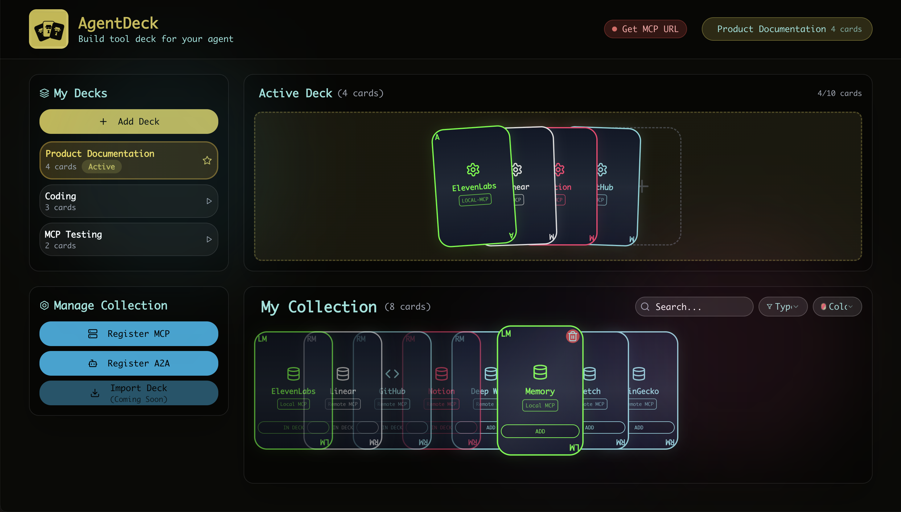
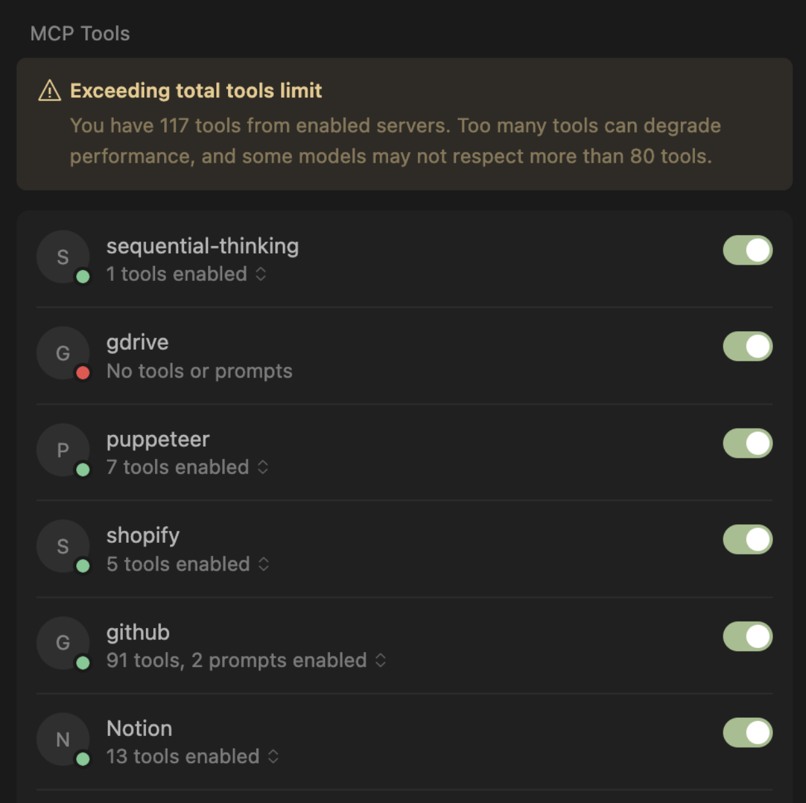
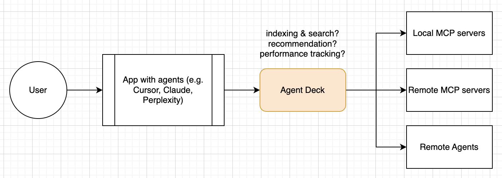
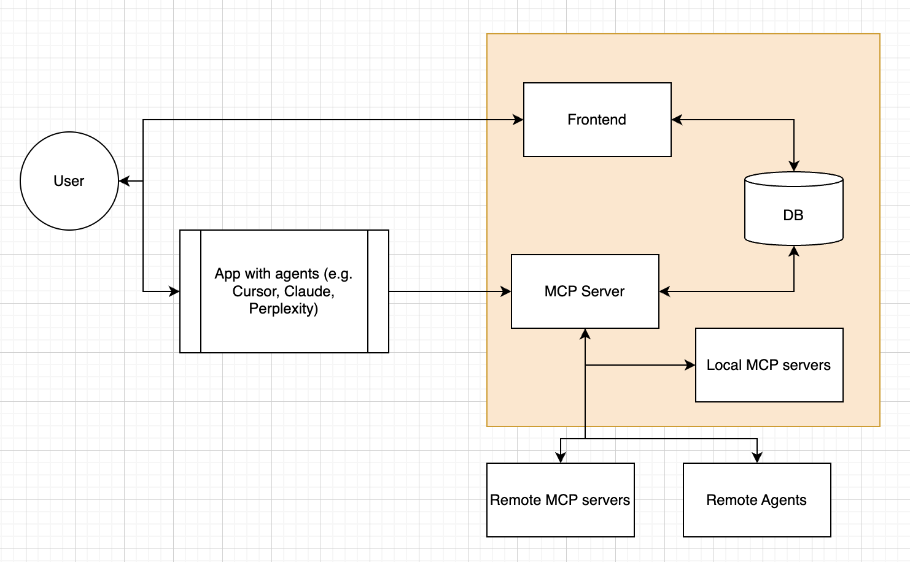

# Agent Deck




## What does it solve?



When I use Cursor, there are different contexts;
- Coding
- Product documents writing
- Task management
- Testing new MCP services

in total, many MCP servers would help, but agent will be slower / less accurate when too many servers are connected.
But for each context I don't need many servers.

## Idea: Local app for MCP access (like a browser FOR agents)

In local app you can manage what MCP servers you want to use, and provide a single MCP server to access anything.


At this moment, AgentDeck is manual favorite MCP management app.



## Features

### **Backend API Server**
- **Service Management**: Register, update, delete MCP and A2A services
- **Deck Management**: Create, update, delete decks with service collections
- **Health Monitoring**: Real-time service health checking
- **OAuth Support**: OAuth 2.0 discovery and UI (flow implementation in progress)
- **WebSocket**: Real-time updates for service status changes

### **MCP Server**
- **Unified Interface**: Single MCP server that routes to active deck services
- **Tool Discovery**: List all tools from services in active deck
- **Tool Calling**: Call tools from any service in active deck
- **Resource Access**: Access resources from deck services
- **Prompt Management**: List and retrieve prompts from services
- **Database Integration**: Automatically reads active deck from database

### **Frontend**
- **Cyberpunk-themed UI** with card-based interface
- **Drag & Drop**: Build decks by dragging service cards
- **Real-time Updates**: Live service health monitoring
- **Service Registration**: Add MCP and A2A services
- **Deck Management**: Create and manage multiple decks
- **Search & Filter**: Find services quickly


## Architecture

### **Packages:**
- **`@agent-deck/shared`** - Shared types, schemas, and utilities
- **`@agent-deck/backend`** - Fastify API server with SQLite database and the MCP server (HTTP transport)

### **Apps:**
- **`apps/agent-deck`** - React frontend (coming soon - will integrate existing frontend)


## Quick Start

### **Prerequisites**
- Node.js 20.x LTS (required)
- npm or yarn

Note on Node version:
- If you use Homebrew, ensure Node 20 is first in PATH:
  - macOS (arm64): `export PATH="/opt/homebrew/opt/node@20/bin:$PATH"`
- If you use nvm, run: `nvm install 20 && nvm use 20`
- Native modules like `better-sqlite3` are built against the active Node; using Node 20 avoids NODE_MODULE_VERSION mismatches.

### **Installation**
```bash
git clone <repository>
cd agent-deck
npm install
```

### **Development**
```bash
# Build all packages
npm run build

# Start development servers (monorepo)
npm run dev

# Start all services with one command (backend 8000, frontend 3000, MCP 3001)
npm run dev:all

# Run tests
npm test
```

### **Running Individual Services**

#### **Backend API Server**
```bash
cd packages/backend
npm run dev
# Server runs on http://localhost:8000
```

#### **MCP Server (TypeScript, HTTP transport)**
```bash
cd packages/backend
npm run mcp
# MCP server runs on http://localhost:3001
# MCP endpoint: POST http://localhost:3001/mcp (requires MCP client/session)
```

#### **Frontend (Vite dev server)**
```bash
cd apps/agent-deck
npm run dev -- --port 3000 --strictPort
# Frontend runs on http://localhost:3000 (proxies /api and /ws to http://localhost:8000)
```

Recommended startup order:
1) Backend (8000) → 2) Frontend (3000) → 3) MCP (3001)


## API Endpoints

### **Services**
- `GET /api/services` - List all services
- `POST /api/services` - Create new service
- `GET /api/services/:id` - Get service details
- `PUT /api/services/:id` - Update service
- `DELETE /api/services/:id` - Delete service
- `GET /api/services/:id/tools` - Discover service tools
- `POST /api/services/:id/call` - Call service tool
- `GET /api/services/:id/health` - Check service health

### **Decks**
- `GET /api/decks` - List all decks
- `POST /api/decks` - Create new deck
- `GET /api/decks/active` - Get active deck
- `GET /api/decks/:id` - Get deck details
- `PUT /api/decks/:id` - Update deck
- `DELETE /api/decks/:id` - Delete deck
- `POST /api/decks/:id/activate` - Set as active deck
- `POST /api/decks/:id/services` - Add service to deck
- `DELETE /api/decks/:id/services` - Remove service from deck
- `PUT /api/decks/:id/services/reorder` - Reorder deck services

### **OAuth** ⚠️ **Discovery Complete, Flow in Progress**
- `GET /api/oauth/:serviceId/discover` - Discover OAuth config ✅
- `GET /api/oauth/:serviceId/authorize` - Initiate OAuth flow ⚠️ **Not implemented**
- `GET /api/oauth/:serviceId/callback` - Handle OAuth callback ⚠️ **Not implemented**
- `POST /api/oauth/:serviceId/refresh` - Refresh OAuth token ⚠️ **Not implemented**
- `GET /api/oauth/:serviceId/status` - Get OAuth status ⚠️ **Not implemented**

**Current Status:**
- ✅ OAuth discovery working (automatically detects OAuth requirements)
- ✅ OAuth UI integration complete (shows OAuth setup instructions)
- ❌ OAuth flow not yet implemented (authorization, callback, token management)

### **WebSocket**
- `WS /api/ws/events` - Real-time updates

## Troubleshooting

- Native module error (better-sqlite3) after switching Node versions
  - Symptom: ERR_DLOPEN_FAILED / NODE_MODULE_VERSION mismatch
  - Fix: ensure Node 20 is active, then reinstall
    - With Homebrew Node 20 active in PATH, run from repo root:
      - `rm -rf node_modules packages/*/node_modules apps/*/node_modules && npm ci`

- Port already in use
  - 3000 (frontend) or 3001 (MCP) might be occupied by a previous run
  - Free the port and restart:
    - macOS: `kill -9 $(lsof -t -iTCP:3000 -sTCP:LISTEN)` (swap 3000 for 3001 as needed)
  - Or start Vite with `--strictPort` to fail fast: `npm run dev -- --port 3000 --strictPort`

- MCP cannot reach backend (ECONNREFUSED in MCP logs)
  - Confirm backend health: `curl http://127.0.0.1:8000/health`
  - MCP backend status: `curl http://127.0.0.1:3001/backend-status`
  - Ensure backend is started before MCP and that ports match defaults.

## MCP Server Usage

The MCP server (inside `@agent-deck/backend`) provides a unified interface to services in the active deck using the official MCP SDK over HTTP transport.

### **Tools (partial)**
- `get_services`: List all services
- `get_decks`: List all decks
- `get_active_deck`: Get the active deck
- `list_active_deck_services`: List services in the active deck
- `list_service_tools(serviceId)`: Discover tools for a service
- `call_service_tool(serviceId, toolName, arguments?)`: Call a tool on a registered service via backend `/api/services/:id/call`

Notes:
- The HTTP transport requires a valid MCP session. Use an MCP client (Cursor, `use-mcp`, or the official SDK client) to connect and call tools. Direct `curl` requires session headers and is not recommended for normal use.

## Database Schema

### **Services Table**
- `id` (TEXT PRIMARY KEY)
- `name` (TEXT NOT NULL)
- `type` (TEXT NOT NULL) - 'mcp' or 'a2a'
- `url` (TEXT NOT NULL)
- `health` (TEXT DEFAULT 'unknown')
- `description` (TEXT)
- `card_color` (TEXT DEFAULT '#7ed4da')
- `is_connected` (INTEGER DEFAULT 0)
- `last_ping` (TEXT)
- `registered_at` (TEXT NOT NULL)
- `updated_at` (TEXT NOT NULL)
- OAuth fields for authentication

### **Decks Table**
- `id` (TEXT PRIMARY KEY)
- `name` (TEXT NOT NULL)
- `description` (TEXT)
- `is_active` (INTEGER DEFAULT 0)
- `created_at` (TEXT NOT NULL)
- `updated_at` (TEXT NOT NULL)

### **Deck Services Table**
- `deck_id` (TEXT NOT NULL)
- `service_id` (TEXT NOT NULL)
- `position` (INTEGER NOT NULL)

## 📚 **Documentation**

- **[Setup Guide](docs/SETUP.md)** - Complete installation and setup instructions
- **[User Guide](docs/USER_GUIDE.md)** - How to use Agent Deck features
- **[Architecture Guide](docs/ARCHITECTURE.md)** - Technical architecture and design
- **[Development Guide](docs/DEVELOPMENT.md)** - Development workflow and guidelines
- **[Integration Guide](docs/INTEGRATION.md)** - Integration and migration documentation

## Development

### **Project Structure**
```
agent-deck/
├── packages/
│   ├── shared/           # Shared types, schemas, utilities
│   └── backend/          # Fastify API server + MCP server (HTTP)
├── apps/
│   └── agent-deck/       # React frontend
├── docs/                 # Documentation
└── misc/                 # Assets and misc files
```

### **Testing**
```bash
# Run all tests
npm test

# Run tests for specific package
cd packages/backend && npm test
cd apps/agent-deck && npm test
cd packages/shared && npm test
```

### **Building**
```bash
# Build all packages
npm run build

# Build specific package
cd packages/backend && npm run build
```
