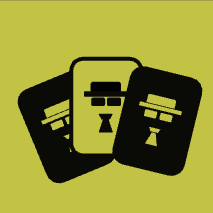

#  Agent Deck

[](https://modelcontextprotocol.io)
[](docs/MCP_APP.md)
[](docs/CURSOR_PLUGIN.md)
[](LICENSE)


[](https://www.youtube.com/watch?v=TeLXBKkWkFA)

**One MCP endpoint. Many servers. Switch context with decks.**

[Quick Start](#quick-start) · [MCP App in Cursor](#mcp-app-in-cursor) · [Cursor Plugin](#cursor-plugin) · [Docs](#documentation)


## Problem: Too Many MCPs on My Agent


People use agent apps like Cursor for many purposes and eventually connect **many MCP servers**. The agent slows down and becomes less accurate with too many tools loaded at once.

When coding, documenting, or trying new MCP services, you don't need every server connected — only the ones that fit the current context.


## Idea: Local MCP Proxy with Decks


Agent Deck is a **local context-aware MCP proxy**. Connect one endpoint (`http://127.0.0.1:3001/mcp`) to your agent. It exposes only the MCP servers in your **active deck**.


## Features

### Dashboard (`localhost:3000`)


- Register remote and local MCP servers (with OAuth support)
- Create **decks** — named contexts (Coding, Docs, Research, …)
- Drag-and-drop services into decks
- Activate one deck at a time for your agent

### MCP Server (`localhost:3001/mcp`)

| Tool | Purpose |
|------|---------|
| `show_agent_deck` | **MCP App** — in-chat deck panel (Cursor 2.6+) |
| `activate_deck` | Switch active deck |
| `get_decks` | List all decks |
| `get_active_deck` | Active deck + services |
| `list_active_deck_services` | Services in active deck |
| `list_service_tools` | Tools for a service |
| `call_service_tool` | Call a proxied MCP tool |

### MCP App in Cursor

Hosts with [MCP Apps](https://modelcontextprotocol.io/extensions/apps/overview) support (e.g. **Cursor 2.6+**) can render an interactive control panel in chat:

1. Run Agent Deck (`npm run dev:all`)
2. Connect MCP: `http://127.0.0.1:3001/mcp`
3. Ask: **"Show my Agent Deck"**

The app shows your active deck, connected services, deck switching, and a link to the full dashboard. See [MCP App guide](docs/MCP_APP.md).

### Cursor Plugin

Install via the [Cursor plugin](plugin/) or add to `~/.cursor/mcp.json`:

```json
{
  "mcpServers": {
    "agent-deck": { "url": "http://127.0.0.1:3001/mcp" }
  }
}
```

Includes a skill so the agent knows how to use decks and the MCP App. See [Cursor plugin guide](docs/CURSOR_PLUGIN.md).


## Quick Start

### Prerequisites

- **Node.js 20.x LTS**
- npm or yarn

```bash
# nvm
nvm install 20 && nvm use 20

# Homebrew (macOS arm64)
export PATH="/opt/homebrew/opt/node@20/bin:$PATH"
```

### Install & run

```bash
git clone https://github.com/not-so-fat/agent_deck.git
cd agent_deck
npm install
npm run build
npm run dev:all
```

This starts:
- Dashboard → `http://localhost:3000`
- Backend API → `http://localhost:8000`
- MCP server → `http://127.0.0.1:3001/mcp`

### Connect your agent

1. **Set up decks** at `http://localhost:3000` — add MCP servers, create decks, activate one
2. **Add MCP** in Cursor (Settings → Tools & MCP) or use [`.cursor/mcp.json`](.cursor/mcp.json)
3. **Try the MCP App** — ask *"Show my Agent Deck"*


## Documentation

| Guide | Description |
|-------|-------------|
| [Setup](docs/SETUP.md) | Installation and configuration |
| [User Guide](docs/USER_GUIDE.md) | Decks, services, OAuth |
| [MCP App](docs/MCP_APP.md) | In-chat UI (experimental) |
| [Cursor Plugin](docs/CURSOR_PLUGIN.md) | Marketplace plugin & skill |
| [MCP Registry](docs/MCP_REGISTRY.md) | Publish to official registry |
| [Architecture](docs/ARCHITECTURE.md) | Technical design |
| [MVP](docs/MVP.md) | v2 MVP spec — vault, playbooks, repo deck (Modules 1–3) |
| [Integration](docs/INTEGRATION.md) | MCP client integration |

## Discoverability

Agent Deck can be listed on:

| Channel | Status | Notes |
|---------|--------|-------|
| **GitHub** | Ready | Public repo, README, demo GIF |
| **Cursor Marketplace** | Plugin ready | Submit [`plugin/`](plugin/) |
| **MCP Registry** | Metadata ready | [`server.json`](server.json) — needs npm publish |
| **Claude Directory** | Future | Desktop extension (MCPB) path |
| **ChatGPT Apps** | Future | Requires hosted remote MCP |

## Future Plan

- Simpler install (`npx agent-deck`)
- MCP Registry npm package publish
- Passthrough for downstream MCP Apps
- Usage analytics and smarter deck recommendations
