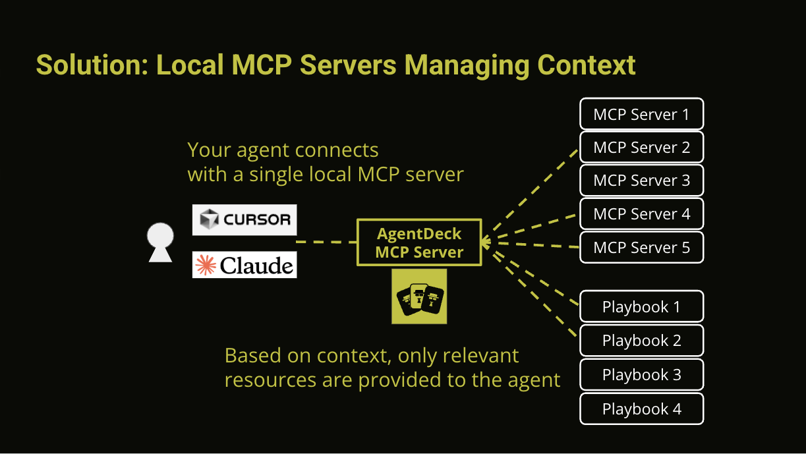
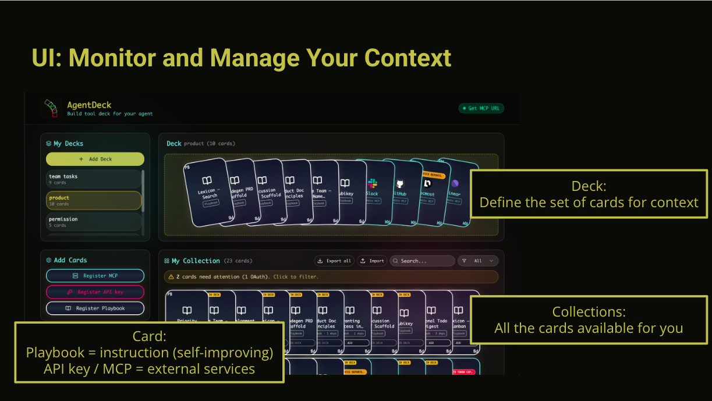

# Agent Deck

[](https://modelcontextprotocol.io)
[](LICENSE)

**Switch what your agent knows — decks of tools, keys, and self-improving playbooks.**

[Why](#why) · [Quick Start](#quick-start) · [Reference](#reference) · [Docs](#documentation)

<!-- DEMO VIDEO/GIF — drop the demo here.
     On github.com, drag the .mp4 into the README editor to get a user-attachments URL,
     then paste it on its own line. GIF fallback:

-->

## Why

You lean on one agent for everything — client code, triage, releases, research. Each kind of work needs its own MCP servers, API keys, and procedures. Wire them all into the agent at once and the tool list balloons: the agent slows down, picks the wrong integration, or leaks one client's context into another's. And the procedures you carefully explained live in old chat threads — you re-explain the same release checklist every session.

**Monday, 9am — client bug.** You say *"use the acme deck."* The agent binds that client's Linear and repo MCP servers, their keys from your Keychain, and the `code-review` playbook that encodes how they like PRs. Only that deck's tools are in play.

**Same afternoon — your own release.** *"Switch to the dev deck."* Different tools, different keys, and the `ship-to-npm` playbook with the checklist you refined last month. Nothing from acme leaks in.

**You correct the agent once** — "changelog entries go newest-first." Instead of dying with the thread, the correction becomes a playbook **patch proposal**; you accept it in the dashboard, and every future session — Cursor or Claude Code — starts from what you taught it, not from scratch.

One MCP endpoint, registered once. Decks scope it per job; playbooks make it compound.



### Run your day through it

[agent-dealer](https://github.com/not-so-fat/agent-dealer) is the execution half: queue tasks against a deck, approve the plan before anything runs, execute headless under budget caps, review results, and gate every outbound send. Dealer runs consume deck playbooks and file patch proposals back — every run makes the next one better. ([Direction](docs/DIRECTION.md))

## Quick Start

> **⚠️ macOS required.** API key secrets, OAuth client secrets, and OAuth tokens are stored in **macOS Keychain**. Linux and Windows are not supported for production use yet ([dev file fallback only](docs/SETUP.md#secrets--oauth-storage)).

**Requirements:** Node.js 20+ · npm · Dashboard `http://127.0.0.1:1111` · Agent Deck MCP `http://127.0.0.1:1110/mcp`

### 1. Install and launch

```bash
npm install -g @agent-deck/cli
agent-deck start --daemon
```

Open `http://127.0.0.1:1111`. Day to day: `agent-deck start --daemon` / `agent-deck stop` · `agent-deck status` if something fails. Use plain `agent-deck start` only when you want a foreground process in an open terminal (logs go to stdout).

### 2. Register Agent Deck in your agent

Your host must know **`http://127.0.0.1:1110/mcp`** — not Linear, Notion, or other services. Without this, chat cannot reach your decks or collection.

**Two layers** (one-time machine setup, then operate from the agent):

| Command | When | What it does |
|---------|------|----------------|
| **`setup`** | **Once** per machine | MCP URL + [agent harness](docs/AGENT_HARNESS.md) — teaches the agent `get_decks`, `bind_workspace`, `switch_bound_deck`, playbooks, proposals |
| **`use <deck>`** | **Optional**, once per repo | Default deck hint (`.agent-deck/use.json`) + thin **trigger stubs** for better implicit playbook matching — bodies still live on the deck |

Day to day you **do not** need `use`. Say *“use the dev deck”* (or *“switch to work deck”*) in chat; the agent binds via MCP. `use` is for repos where you want a stable default deck and host-native trigger discovery without repeating the deck name every session.

`setup` also installs the terminal status line by default (`--no-statusline` to skip).

#### Cursor

```bash
agent-deck setup --client cursor    # once
```

Optional per repo: `agent-deck use my-deck` → project `.cursor/mcp.json`, stubs under `.cursor/rules/agent-deck-stubs/`

Or **Settings → Tools & MCP → Add custom MCP** (HTTP) with the URL above. **Restart Cursor** — `agent-deck` should show connected while `agent-deck start` is running.

#### Claude Code

```bash
agent-deck setup --client claude    # once
```

Optional per repo: `agent-deck use my-deck` → `.mcp.json`, stubs under `.claude/skills/agent-deck-*/`

**Restart Claude Code**, then `claude mcp list` — `agent-deck` should be **Connected**.

If you use `use` and accept playbook patches that change **triggers**, run `agent-deck use --refresh` in that repo (or ask the agent to).

### 3. Create a deck



A **deck** bundles external MCP servers, API keys, and playbooks for one context (e.g. “work”, “this client”).

**Dashboard:** **My Decks** → create a deck → drag cards from **My Collection** (after steps 4–5).

**Agent chat:** ask the agent to create a deck and add cards.

### 4. Register playbooks (agent-first)

Describe the procedure in chat — e.g. *“Add a release checklist playbook with trigger ‘ship to npm’.”* Let the agent register it and attach it to your deck. It can refine the playbook from your feedback over time.

The dashboard can add playbooks too; chat authoring usually works better. Corrections become **proposals** you review in the dashboard (Playbook patches); accepted changes update the deck. If you use per-repo `use` stubs and triggers changed, refresh with `agent-deck use --refresh`.

### 5. Add external MCP servers and API keys

Third-party services (Linear, Notion, Slack, …) — **not** `:1110`, which is only the Agent Deck proxy.

| What | Metadata | Secrets / OAuth |
|------|----------|-------------------|
| **External MCP** | Agent or dashboard | **Dashboard** — OAuth in browser |
| **API key** | Agent or dashboard | **Dashboard** — paste once into Keychain |

Drag cards onto your deck in the dashboard, or ask the agent when building the deck.

### 6. Pick a deck each session

**Default (agent-operated):** no repo config required. Tell the agent which deck — *“use the dev deck”*, *“work deck for this project”*, or mid-session *“switch to my personal deck”*. It calls `bind_workspace` / `switch_bound_deck` over MCP.

**Optional `agent-deck use`:** writes `.agent-deck/use.json` so the agent can bind that deck on session open without you naming it; trigger stubs improve playbook matching.

Terminal agents show the active deck in the footer (`◆ dev · 2 MCP · …`). If it stays unbound, check `agent-deck start` and that the deck exists in **My Decks**.

---

## Reference

For contributors, dev ports (`:3000` / `:8000` / `:3001`) and env vars → [Setup](docs/SETUP.md) · [Development](docs/DEVELOPMENT.md).

**Dashboard:** collection + deck editor · OAuth and API key secrets (Keychain) · per-tool toggles · export/import layouts (`.agent-deck.json`, no secrets) · collection warnings.

**Agent MCP** (`http://127.0.0.1:1110/mcp`): decks, collection, external MCP proxy, playbooks. Secrets, OAuth, and deletes stay on dashboard/CLI. Tool catalog → [MVP](docs/MVP.md).

**CLI:** `agent-deck use` · `agent-deck export` / `import` · `credential` · `exec` (inject keys) · `upgrade`

## Install & run

After first-time [Quick Start](#quick-start):

```bash
agent-deck start --open
agent-deck upgrade
agent-deck stop
```

Port conflicts: `agent-deck status` · `agent-deck start --force`

## Documentation

**Index:** [docs/README.md](docs/README.md) · **Security:** [SECURITY.md](SECURITY.md)

| Guide | Description |
|-------|-------------|
| [Direction](docs/DIRECTION.md) | Cross-product direction — agent_deck + agent-dealer |
| [Setup](docs/SETUP.md) | Ports, env vars, secrets, troubleshooting |
| [MVP](docs/MVP.md) | Source of truth — decks, vault, playbooks, MCP tools |
| [Agent harness](docs/AGENT_HARNESS.md) | What `setup` installs |
| [Playbooks vs Cursor skills](docs/PLAYBOOKS_AND_SKILLS.md) | Deck playbooks vs Cursor skills |
| [Export / import](docs/PRD_EXPORT_IMPORT.md) | Portable layout bundles |
| [Deck display](docs/PRD_DECK_DISPLAY.md) | Terminal status line |
| [Codex / Claude plugin](docs/CODEX_PLUGIN.md) | Marketplace packaging (HOL / Codex / Claude Code) |
| [Architecture](docs/ARCHITECTURE.md) | SQLite, Keychain, components |
| [Development](docs/DEVELOPMENT.md) | Contributors |
| [Publishing](docs/PUBLISHING.md) | npm release |

## Discoverability

| Channel | Notes |
|---------|-------|
| **GitHub** | Demo GIF, this README |
| **npm** | `npm install -g @agent-deck/cli` |
| **MCP Registry** | `server.json` — [Publishing](docs/PUBLISHING.md) |
| **Codex marketplace** | `.codex-plugin/` + HOL listing (pending awesome-codex-plugins PR after green CI) — [CODEX_PLUGIN.md](docs/CODEX_PLUGIN.md) |
| **Claude Code** | `/plugin marketplace add` via `.claude-plugin/` |
| **Cursor** | `agent-deck setup --client cursor` |

## What's next

- Open HOL [awesome-codex-plugins](https://github.com/hashgraph-online/awesome-codex-plugins) README PR once scanner CI is green on `main`
- Optional: stdio MCP transport (`agent-deck mcp --stdio`) for on-demand plugin start
- Passthrough for downstream MCP Apps
- Smarter deck recommendations
