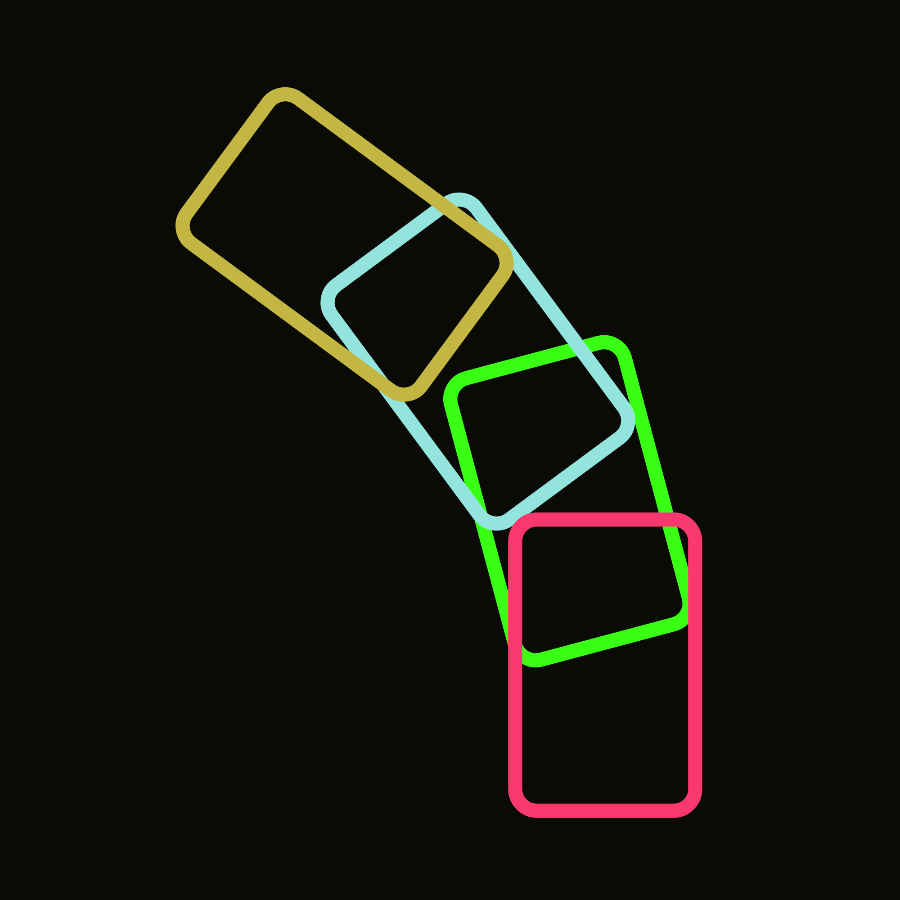
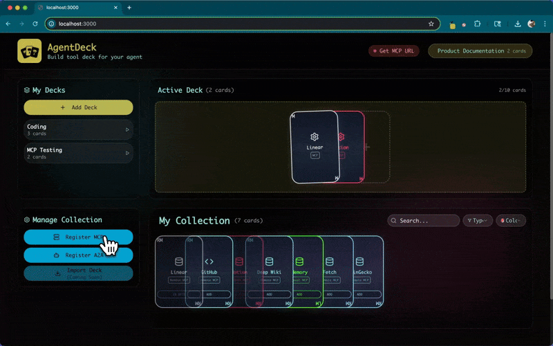
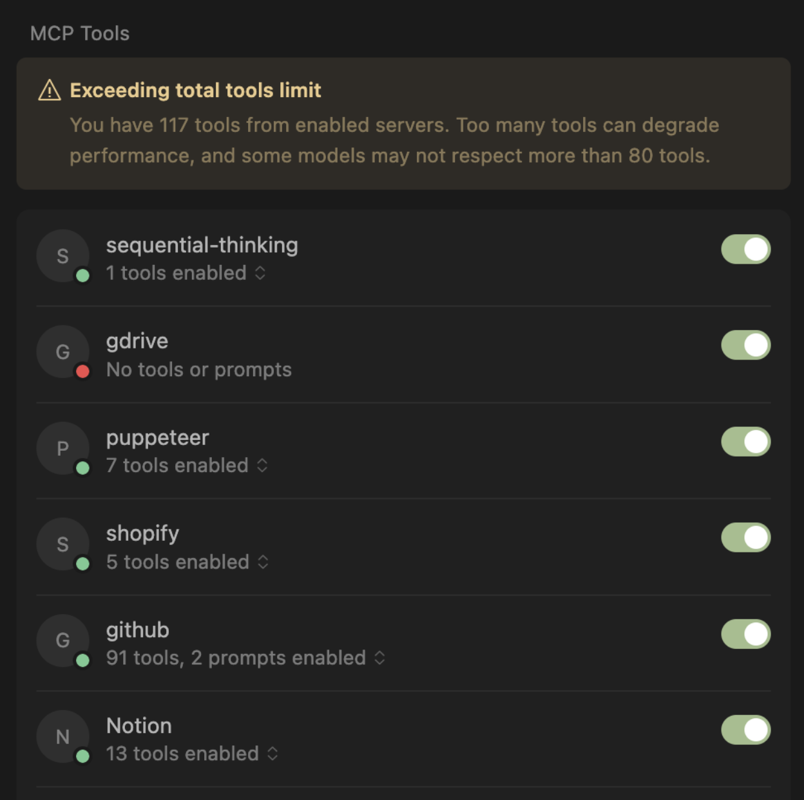

#  Agent Deck

[](https://modelcontextprotocol.io)
[](LICENSE)



[](https://www.youtube.com/watch?v=TeLXBKkWkFA)

**One MCP endpoint. Many servers. Switch context with decks.**

[Quick Start](#quick-start) · [Docs](#documentation)

## Quick Start

**Required (one install)** — MCP, dashboard, vault, agent tools:

```bash
npx @agent-deck/cli@latest setup --client cursor --start
# or: --client claude
# dashboard → http://127.0.0.1:11111 · MCP → http://127.0.0.1:11112/mcp
```

**Optional — terminal agents** (Claude Code / Cursor CLI prompt footer): installed automatically by `agent-deck setup --client claude|cursor` (use `--no-statusline` to skip). **Not** shown in IDE Agent chat — terminal footer only.

Then open the dashboard, register an MCP or API key, drag cards onto a deck, and copy `.agent-deck/deck.yaml` into a repo. Your agent calls `bind_workspace` to use that deck.

**Dev repo:** `npm install && npm run dev:all` → dashboard `http://localhost:3000`, MCP `http://127.0.0.1:3001/mcp`. See [SETUP.md](docs/SETUP.md).

**Requirements:** Node.js 20+ (24 typical). Full install options below in [Install & run](#install--run).


## Problem: Too Many MCPs on My Agent



People use agent apps like Cursor for many purposes and eventually connect **many MCP servers**. The agent slows down and becomes less accurate with too many tools loaded at once.

When coding, documenting, or trying new MCP services, you don't need every server connected — only the ones that fit the current context.


## Idea: Local MCP Proxy with Decks


Agent Deck is a **local context-aware MCP proxy**. Connect one endpoint (`http://127.0.0.1:3001/mcp`) to your agent. It exposes only the MCP servers in the **deck bound to your workspace** (via `.agent-deck/deck.yaml`). See [MVP spec](docs/MVP.md) for the full Modules 1–3 behavior.


## Features

### Dashboard

**CLI / npx (`agent-deck start`):** `http://127.0.0.1:11111` · MCP `http://127.0.0.1:11112/mcp`  
**dev (`npm run dev:all`):** `http://localhost:3000` · MCP `http://127.0.0.1:3001/mcp` (backend `:8000`)

Both can run on one machine — see [SETUP.md](docs/SETUP.md#ports).


- Register remote and local MCP servers (with OAuth support) and **API keys** (Keychain-backed)
- **My Collection** — MCP (`#92E4DD`), API key, and playbook playing cards
- **Deck editor** — drag-and-drop cards from collection onto a deck fan (agents can also link via MCP tools)
- **MCP service details** — health status, per-tool enable/disable table, OAuth connect
- **API key details** — edit name/docs link, rotate key; secret value never shown after save
- **Collection warnings** — missing secrets, OAuth, or playbook dependencies
- Copy `.agent-deck/deck.yaml` from the deck sidebar; agents **bind** via `bind_workspace`

### MCP Server

| Mode | URL |
|------|-----|
| **CLI / npx** | `http://127.0.0.1:11112/mcp` |
| **Dev repo** | `http://127.0.0.1:3001/mcp` |

Most setup and runtime work goes through the agent. **Dashboard-only (human-in-the-loop):** storing API key **secrets** and completing MCP **OAuth** in the browser.

| Tool | Purpose |
|------|---------|
| `bind_workspace` / `switch_bound_deck` / `get_session_binding` | Bind workspace; session deck override; inspect binding |
| `setup_repo_deck` / `get_repo_deck_status` | Create or check `.agent-deck/deck.yaml` |
| `get_decks` / `get_bound_deck` / `create_deck` | List, read, or create decks |
| `list_bound_deck_services` / `list_bound_deck_credentials` | Cards on the bound deck |
| `list_collection_services` / `register_service` / `update_service` / `delete_service` | MCP collection CRUD |
| `add_service_to_bound_deck` / `remove_service_from_bound_deck` | Link or unlink MCP cards on bound deck |
| `update_service_tool_settings` | Enable/disable individual MCP tools (bound deck) |
| `list_collection_credentials` | API key metadata (no secrets) — use ids to link keys |
| `add_credential_to_bound_deck` / `remove_credential_from_bound_deck` | Link or unlink API key cards |
| `list_playbooks` / `list_collection_playbooks` / `get_playbook` | Read playbook cards |
| `register_playbook` / `update_playbook` / `delete_playbook` | Create, update, or delete playbooks |
| `add_playbook_to_bound_deck` / `remove_playbook_from_bound_deck` | Link or unlink playbook cards |
| `list_service_tools` / `call_service_tool` | Discover and call tools on bound-deck MCPs |

Legacy aliases (`get_active_deck`, `list_active_deck_*`, …) remain for v1 compatibility. Full spec: [MVP](docs/MVP.md).

### Connect MCP in Cursor

**Recommended:** one command writes config for you:

```bash
npx @agent-deck/cli setup --client cursor
# project-only: --scope project
```

Or add manually to **Settings → Tools & MCP** or `~/.cursor/mcp.json`:

```json
{
  "mcpServers": {
    "agent-deck": { "url": "http://127.0.0.1:11112/mcp" }
  }
}
```


## Install & run

**One-shot setup** (same as [Quick Start](#quick-start) above):

```bash
npx @agent-deck/cli@latest setup --client cursor --start
# or: --client claude | claude-desktop
# project-scoped: --scope project
```

Setup installs **MCP config** and **agent harness** (global Cursor rule or Claude `CLAUDE.md` section) — see [Agent harness](docs/AGENT_HARNESS.md).

**Or start without re-running setup:**

```bash
npx @agent-deck/cli@latest start --open
# Dashboard → http://127.0.0.1:11111  (CLI; dev repo uses :8000 / :3000)
# MCP       → http://127.0.0.1:11112/mcp
```

**Updates:** `agent-deck upgrade` checks npm and reinstalls globally. On `start`, a cached check notifies when a newer version exists. Set `AGENT_DECK_AUTO_UPGRADE=1` to upgrade automatically before starting.

**Port conflicts:** `agent-deck status` shows what's running; `agent-deck stop` frees ports; `agent-deck start` reuses an existing instance; `agent-deck start --force` restarts.

See [Publishing & install](docs/PUBLISHING.md) for version bumps and npm publish.

**From source (development):**

```bash
git clone https://github.com/not-so-fat/agent_deck.git
cd agent_deck
npm install
npm run build
npm run dev:all
```

This starts:
- Dashboard → `http://localhost:3000` (Vite dev server)
- Backend API → `http://localhost:8000`
- MCP server → `http://127.0.0.1:3001/mcp`

Or after build: `npm run build:release && npx @agent-deck/cli start`

### Prerequisites

- **Node.js 24** (typical OS default) or **20+** — see [Setup](docs/SETUP.md#nodejs-version-policy)
- npm

```bash
node -v    # v24.x expected on new machines
```

Node 20+ is supported; the repo does **not** ask you to downgrade from 24.

### Connect your agent

1. **Set up decks** — dashboard at `http://127.0.0.1:11111` (CLI) or `http://localhost:3000` (dev). Register MCPs, store API key secrets, build a deck, copy `deck.yaml` into your repo
2. **Add MCP** — `agent-deck setup --client cursor` (or see [Connect MCP in Cursor](#connect-mcp-in-cursor))
3. **Bind workspace** — agent calls `bind_workspace` with your repo root (or set `AGENT_DECK_WORKSPACE`)
4. **Manage from chat** — register MCPs, link cards, toggle tools, and call service tools via MCP; use the dashboard only for secrets and OAuth

(Steps 1–2 run `setup`, which also installs the [agent harness](docs/AGENT_HARNESS.md) in your global Cursor rules or Claude `CLAUDE.md`.)


## Documentation

**Index:** [docs/README.md](docs/README.md) — layout, naming, shipped vs stale docs.

| Guide | Description |
|-------|-------------|
| [Setup](docs/SETUP.md) | **Install, ports, dashboard, env vars** |
| [OAuth & hosting](docs/OAUTH_AND_HOSTING.md) | **Local vs hosted, HTTPS, Slack paths** |
| [OAuth requirements](docs/OAUTH_REQUIREMENTS.md) | **Product OAuth needs, marketplace, Stytch feasibility** |
| [Publishing](docs/PUBLISHING.md) | npm publish, versioning, Claude Code install |
| [Architecture](docs/ARCHITECTURE.md) | Components, SQLite, secret storage |
| [MVP](docs/MVP.md) | **Source of truth** — vault, playbooks, repo deck, agent tools |
| [PRD: Export / import](docs/PRD_EXPORT_IMPORT.md) | Proposed — laptop migration bundles |
| [PRD: Deck display](docs/PRD_DECK_DISPLAY.md) | Terminal statusline + harness session opener (IDE Agent chat) |
| [Playbooks vs Skills](docs/PLAYBOOKS_AND_SKILLS.md) | When to use playbook cards vs Cursor skills |
| [Agent harness](docs/AGENT_HARNESS.md) | **CLAUDE.md & Cursor rules** from `setup` |
| [Monorepo scope](docs/MONOREPO_SCOPE.md) | Where to put `deck.yaml` in monorepos |
| [Development](docs/DEVELOPMENT.md) | Contributing, tests, workflow |
| [MCP integration strategy](docs/MCP_INTEGRATION_STRATEGY.md) | OAuth tiers, provider reality, deferred work |
| [Slack OAuth app (maintainers)](docs/SLACK_OAUTH_APP.md) | Shared Slack app for one-click Connect |
| [Slack read-only workaround](docs/SLACK_READ_WORKAROUND.md) | Skip official MCP for DM/channel read |

## Discoverability

Agent Deck can be listed on:

| Channel | Status | Notes |
|---------|--------|-------|
| **GitHub** | Ready | Public repo, README, demo GIF |
| **npm** | Ready | `npx @agent-deck/cli setup --client cursor --start` — see [Publishing](docs/PUBLISHING.md) |
| **MCP Registry** | Metadata ready | `server.json` — publish after npm |

## Future Plan

- Cursor **plugin** packaging (rules/skills/MCP bundle)
- Passthrough for downstream MCP Apps
- Usage analytics and smarter deck recommendations
