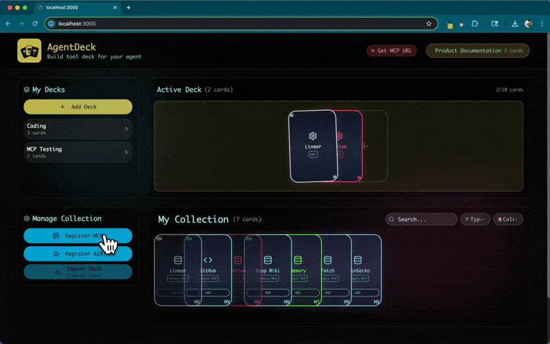

#  Agent Deck



[](https://www.youtube.com/watch?v=TeLXBKkWkFA)

[Quick Start](#quick-start)


## Problem: Too Many MCPs on My Agent


People are using agent app like Cursor for many purposes, eventually they would have **many MCP servers** to provide different tools.
However agent app slows down, and becomes inaccurate with too many MCP servers.

On the other hand, when I use Cursor, there are different contexts (Coding, documentation, task management, just try new MCP services), I don't need to connect all the servers at once.


## Idea: Local MCP Servers Managing Context


AgentDeck provides a local MCP server, which acts as a local context-aware MCP server. You can connect one endpoint for your agent (http://127.0.0.1:3001/mcp), which connects to your favorite MCP servers, but only to ones fit on the context you choose.


## Features

### Frontend UI


1. Register as many MCP servers into your collections (Remote / Local)
    - If it requires OAuth authentication, follow the instruction on UI to configure it
2. Create "deck" as your context
3. Put / remove MCP servers into your deck
4. Choose one deck as "active" which is connected to agent 


### **MCP Server**
1. Configure your agent to connect AgentDeck MCP server at "http://127.0.0.1:3001/mcp". It has 5 tools;
    - get_decks
    - get_active_deck
    - list_active_deck_services
    - list_service_tools
    - call_service_tool
2. Asking query as usual, AgentDeck MCP can use services on active deck. 


## Quick Start

### **Prerequisites**
- Node.js 20.x LTS (required)
- npm or yarn

Note on Node version:
- If you use Homebrew, ensure Node 20 is first in PATH:
  - macOS (arm64): `export PATH="/opt/homebrew/opt/node@20/bin:$PATH"`
- If you use nvm, run: `nvm install 20 && nvm use 20`
- Native modules like `better-sqlite3` are built against the active Node; using Node 20 avoids NODE_MODULE_VERSION mismatches.

### **Installation**
```bash
git clone <repository>
cd agent-deck
npm install
npm run build
```

### **Run Service**
```bash
# Start all services with one command (backend 8000, frontend 3000, MCP 3001)
npm run dev:all
```

### **Try AgentDeck**

1. **Access UI (`http://localhost:3000`) and Manage Services**: 
    - Add MCP servers to your collection (Remote or Local)
    - Create decks to organize services for different contexts
    - Activate a deck you want to use
2. ** Connect MCP server (`http://127.0.0.1:3001/mcp`) to use them
    - Configure on your agent
    - MCP server let your agent access tools in active deck

## **Documentation**

- **[Setup Guide](docs/SETUP.md)** - Complete installation and setup instructions
- **[User Guide](docs/USER_GUIDE.md)** - How to use Agent Deck features
- **[Architecture Guide](docs/ARCHITECTURE.md)** - Technical architecture and design
- **[Development Guide](docs/DEVELOPMENT.md)** - Development workflow and guidelines
- **[Integration Guide](docs/INTEGRATION.md)** - Integration and migration documentation

## Future Plan
- Ease of use
    - Eliminate Node 20 dependencies
    - Simpler installation through npx -> install with local MCP configuration
- Extend supported services
    - Local MCP with a GitHub repository
    - More tests on OAuth
    - Local / remote agents with agent card
- Insights & intelligence
    - Logging and usage analytics
    - Ratings / Recommendation / Smarter deck switching 