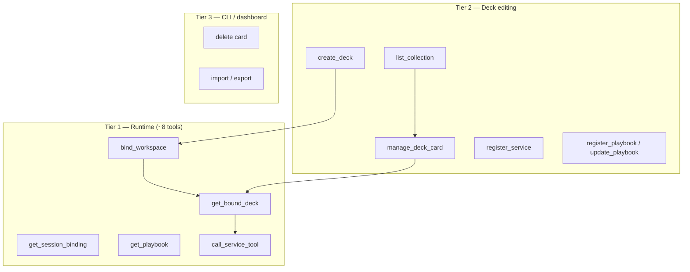

# MCP tool surface optimization

**Status:** Shipped (standard profile default)  
**Audience:** Product + backend  
**Related:** [MVP.md](./MVP.md) (current tool table), [MCP_INTEGRATION_STRATEGY.md](./MCP_INTEGRATION_STRATEGY.md), [AGENT_HARNESS.md](./AGENT_HARNESS.md)

Agent Deck MCP tools are registered in **tiers** (`packages/backend/src/mcp-tools/`). Default profile **`standard`** exposes ~16 tools (down from ~31), including `create_deck`.

## As-built (2026-07)

| Profile | Tools | Use |
|---------|------:|-----|
| `runtime` | ~9 | Bind, read deck, playbooks, proxy — minimal context |
| `standard` | ~16 | **Default** — runtime + deck editing + `create_deck` |
| `legacy` | ~30 | + deprecated aliases (`add_*_to_bound_deck`, `list_playbooks`, …) |

**New tools:** `manage_deck_card`, `list_collection`, `create_deck` (always on standard). **Enriched:** `get_bound_deck` includes `display_summary`. **Harness:** uses `get_bound_deck` instead of `list_bound_deck_services` / `list_playbooks`.

**Not on MCP:** `delete_service`, `delete_playbook`, import/export — **CLI / dashboard** (rare). No `extended` profile or env gate for rare ops.

### Dynamic lazy loading — **blocked by hosts, not by us**

MCP defines `notifications/tools/list_changed` so a server can add tools mid-session and the client re-fetches `tools/list`. Agent Deck could implement that (register rare tools on demand, emit the notification). **Do not ship it yet:**

| Host | Mid-session `list_changed` |
|------|----------------------------|
| **Cursor** | Ignored — tool list frozen until reconnect / manual MCP refresh ([forum](https://forum.cursor.com/t/mcp-notifications-tools-list-changed-not-acted-on-mid-session/161459)) |
| **Claude Code** | Ignored for interactive sessions — ToolSearch index not refreshed ([#66084](https://github.com/anthropics/claude-code/issues/66084), [#4118](https://github.com/anthropics/claude-code/issues/4118)) |

So dynamic lazy loading is **not** “only implementation cost.” Building it now would advertise tools the agent still cannot call until restart — worse UX than CLI.

**When hosts honor `list_changed`:** add rare tools (delete, import/export) behind a small always-on entrypoint that registers them and notifies — no env profile.

**Until then:**

| Surface | Operations |
|---------|------------|
| **MCP (always)** | Bind, read, edit cards, register/update, `create_deck`, proxy |
| **CLI / dashboard** | Delete cards, import/export decks or cards, secrets |

---

## Product policy: who handles what

| Operation class | Surface | Rationale |
|-----------------|---------|-----------|
| **Secrets** — API key values, OAuth tokens | **Dashboard / CLI only** | Never MCP; human-in-the-loop trust boundary |
| **OAuth browser consent** | **Dashboard only** | Requires user click |
| **Runtime** — bind, read deck, proxy, playbooks | MCP default | Every turn |
| **Editing** — link cards, register/update, **`create_deck`** | MCP default | Agents own deck setup; users should not drag cards in UI |
| **Rare ops** — delete card, import/export | **CLI / dashboard** | Infrequent; keep MCP catalog small. Future: dynamic lazy tools if hosts support it |
| **Dashboard UI** | Visual parity | Same REST APIs; optional for humans who prefer cards |

### CLI rare ops (shipped) — not MCP

```bash
agent-deck service list|delete <id>
agent-deck playbook list|delete <id>
agent-deck deck list|delete <id>
```

Delete service blocks when playbooks depend on it (same as dashboard). Import/export is CLI + dashboard — [PRD_EXPORT_IMPORT.md](./PRD_EXPORT_IMPORT.md).

If hosts later support dynamic tool loading, rare ops can also appear as on-demand MCP tools without an env profile.

---

## Executive summary

| Question | Recommendation |
|----------|----------------|
| **Link/unlink cards on a deck** | **One tool** — `manage_deck_card` with `action: link \| unlink \| reorder`, `card_type`, `card_id` |
| **Create/update/delete in collection** | **Keep type-specific tools** (or at most one `manage_collection_item` per *verb*, not one mega-tool) — schemas diverge too much |
| **List bound vs collection** | **Collapse reads** — `get_bound_deck` returns card summaries; one `list_collection` with optional `card_type` filter |
| **Target tool count** | **12–15 tools** in the default agent context (down from ~31) |
| **Deprecated aliases** | Remove `*_active_deck_*` in the next breaking MCP release; document restart requirement ([AGENT_HARNESS.md](./AGENT_HARNESS.md)) |

**Principle:** Optimize for the **runtime path** (bind → use deck → call proxied tools → read playbooks). Treat deck editing as a secondary, still-agent-accessible but narrower surface.

### Growing the server without bloating every session

Use **tiered registration**, not one mega-tool and not an env profile for rare ops:

1. **`runtime`** — what 90% of agent turns need (optional minimal profile).
2. **`standard`** — default: editing + `create_deck`.
3. **`legacy`** — deprecated aliases only while hosts refresh cached tool lists.
4. **Rare ops** — CLI / dashboard today; **dynamic lazy MCP tools** later if hosts support tool-on-demand.

Implementation: `packages/backend/src/mcp-tools/profile.ts` + `register.ts`. **Secrets never get a tier** — permanent dashboard/CLI boundary.

---

## Research: MCP tool design best practices

Sources reviewed:

- [MCP Best Practices (modelcontextprotocol.info)](https://modelcontextprotocol.info/docs/best-practices/) — architecture, security, ops (less about tool granularity)
- [MCP Tool Design (DEV Community / AWS Heroes, 2026)](https://dev.to/aws-heroes/mcp-tool-design-why-your-ai-agent-is-failing-and-how-to-fix-it-40fc)
- [Less is More: MCP design patterns (Klavis)](https://www.klavis.ai/blog/less-is-more-mcp-design-patterns-for-ai-agents)
- [MCP Is Not Your REST API (Ksopyła)](https://ai.ksopyla.com/posts/mcp_best_practices/)
- [MCP Server Architecture Patterns (arXiv)](https://arxiv.org/html/2606.30317v1)

### Findings that apply to Agent Deck

1. **Tool budget.** Selection accuracy degrades non-linearly past ~10–15 tools; sharp cliff past ~20–30. GitHub Copilot cut 40 → 13 tools with measurable benchmark gains. Block’s Linear MCP went 30+ → 2.

2. **Expose capabilities, not endpoints.** REST-shaped 1:1 tool mapping (“add X”, “remove X”, “list X” for every resource) inflates the catalog and burns context every turn (~500–1,000 tokens per tool in many hosts).

3. **Outcome-oriented tools.** High-frequency workflows deserve dedicated tools; rare admin belongs behind fewer entry points, dashboard, or lazy-loaded tiers.

4. **Descriptions are UX.** Unclear purpose in tool metadata causes wrong selection even when the tool set is sized correctly. Names should be verb-first, constraints explicit, errors actionable.

5. **Hub / aggregator pattern.** When a server must expose many capabilities, use **scoped exposure** (proxy filter, tool search, or session phase) rather than static merge of the full catalog ([arXiv §IV-D Proxy Aggregator](https://arxiv.org/html/2606.30317v1)).

6. **Agent Deck is a meta-hub.** Unlike a single-vendor MCP (Linear, GitHub), we manage decks *and* proxy to N downstream MCPs. The optimization target is **our** tool surface; downstream service tools stay on those servers (already accessed via `call_service_tool`).

---

## Current state (as-built)

Implementation: `packages/backend/src/mcp-server.ts`

| Group | Tools | Count |
|-------|-------|------:|
| Session / deck binding | `bind_workspace`, `switch_bound_deck`, `get_session_binding`, `get_decks`, `get_bound_deck`, `get_active_deck` ⚠️, `create_deck` | 7 |
| Bound deck lists | `list_bound_deck_services`, `list_bound_deck_credentials`, `list_playbooks`, `list_active_deck_*` ⚠️ ×2 | 5 |
| Collection lists | `list_collection_services`, `list_collection_credentials`, `list_collection_playbooks` | 3 |
| Service CRUD + deck link | `register_service`, `update_service`, `delete_service`, `add_service_to_bound_deck`, `remove_service_from_bound_deck`, `update_service_tool_settings` | 6 |
| Credential deck link | `add_credential_to_bound_deck`, `remove_credential_from_bound_deck` | 2 |
| Playbook CRUD + deck link | `register_playbook`, `update_playbook`, `delete_playbook`, `add_playbook_to_bound_deck`, `remove_playbook_from_bound_deck` | 5 |
| Proxy | `list_service_tools`, `call_service_tool` | 2 |
| **Total** | | **~31** (27 unique + 4 deprecated) |

### Pain points

| Issue | Impact |
|-------|--------|
| **Over budget** | ~31 tools loaded every turn in Cursor/Claude; competes with host tools and other MCP servers |
| **Redundant reads** | `get_bound_deck` + three `list_bound_deck_*` overlap |
| **Symmetric link/unlink sprawl** | Six tools (`add_*` / `remove_*` × three card types) for the same junction-table operation |
| **Deprecated aliases** | Four extra tools until hosts refresh |
| **REST mirroring** | Collection CRUD mirrors `/api/*` one-to-one instead of user outcomes |

### What works well (keep)

- **`bind_workspace` + `get_session_binding`** — clear session model; powers status line and harness opener
- **`call_service_tool`** — correct “macro” pattern; hides downstream MCP wiring
- **Separate playbook read/write** — harness depends on `get_playbook` / `update_playbook`; high-frequency for Module 3
- **Credentials: link-only via MCP** — secrets stay dashboard/CLI; good security boundary

---

## Design question: per-type link/unlink vs one tool?

Three card types share the same **deck junction** semantics:

| Card type | Link API | Unlink API | Collection survives unlink? |
|-----------|----------|------------|----------------------------|
| MCP service | `POST /api/decks/:id/services` | `DELETE …/services` | Yes |
| API key | `POST /api/decks/:id/credentials` | `DELETE …/credentials` | Yes |
| Playbook | `POST /api/decks/:id/playbooks` | `DELETE …/playbooks` | Yes |

Optional `position` is identical for all three.

### Option A — Per card type (current)

```
add_service_to_bound_deck
remove_service_from_bound_deck
add_credential_to_bound_deck
remove_credential_from_bound_deck
add_playbook_to_bound_deck
remove_playbook_from_bound_deck
```

| Pros | Cons |
|------|------|
| Very explicit names; easy grep in logs | Six tools for one concept |
| Short, focused descriptions | Model must choose among near-duplicates |
| Matches REST mental model for dashboard devs | Poor fit for “fewer tools” research |

### Option B — One unified deck-card tool

```
manage_deck_card
  action: link | unlink | reorder
  card_type: service | credential | playbook
  card_id: string
  position?: number
```

| Pros | Cons |
|------|------|
| Six tools → one | Slightly longer schema |
| One description explains “link existing collection card to bound deck” | Playbook unlink dependency warnings must be in unified errors |
| Aligns with junction-table implementation | Less keyword match for “add slack service” (mitigate in description + examples) |

### Option C — Hybrid (recommended)

- **Unified:** link / unlink / reorder on bound deck (`manage_deck_card`)
- **Type-specific:** create/update/delete in collection and type-specific settings (`register_service`, `update_service_tool_settings`, `register_playbook`, …)

**Why hybrid:** Link/unlink is structurally identical across types. Create/update is not — services carry OAuth/local-mcp fields, playbooks carry markdown body and dependency detection, credentials cannot set secret values via MCP.



---

## Proposed target tool surface (~14 tools)

### Tier 1 — Runtime (always advertised)

| Tool | Purpose | Replaces / notes |
|------|---------|------------------|
| `bind_workspace` | Bind session to workspace + deck | Keep; optional `deckId` on re-bind could subsume `switch_bound_deck` |
| `get_session_binding` | Workspace, effective deck, `display_summary` | Keep |
| `get_decks` | List deck ids/names for bind | Keep (small; needed before bind) |
| `get_bound_deck` | Full bound deck snapshot: services, credential metadata, playbook summaries | Replaces `get_bound_deck` + `list_bound_deck_*` + `list_playbooks` |
| `get_playbook` | Full playbook body when task matches triggers | Keep |
| `update_playbook` | Self-improvement loop in harness | Keep |
| `list_service_tools` | Discover tools on one bound service | Keep; consider lazy tier |
| `call_service_tool` | Proxy to bound MCP services | Keep — core “macro” |

### Tier 2 — Deck & collection editing

| Tool | Purpose | Replaces / notes |
|------|---------|------------------|
| `manage_deck_card` | `link` / `unlink` / `reorder` by `card_type` + `card_id` | Replaces six `add_*` / `remove_*` tools |
| `list_collection` | All collection cards; optional `card_type` filter | Replaces three `list_collection_*` |
| `register_service` | Create MCP card; optional auto-link | Keep; document `add_to_bound_deck: false` |
| `update_service` | Metadata update | Keep |
| `update_service_tool_settings` | Enable/disable proxied tools | Keep — not expressible as generic link |
| `register_playbook` | Create playbook + auto-link | Keep |
| `create_deck` | New deck | MCP standard — agents need this for setup |

### Tier 3 — Not MCP (CLI / dashboard)

| Operation | Surface |
|-----------|---------|
| Delete service / playbook / deck | Dashboard today; CLI when useful |
| Import / export deck or cards | CLI + dashboard — [PRD_EXPORT_IMPORT.md](./PRD_EXPORT_IMPORT.md) |

`create_deck` is **MCP standard** (Tier 2), not rare-tier.

### Remove (breaking, next major)

| Tool | Replacement |
|------|-------------|
| `get_active_deck` | `get_bound_deck` |
| `list_active_deck_services` | `get_bound_deck` |
| `list_active_deck_credentials` | `get_bound_deck` |
| `add_*_to_bound_deck` (×3) | `manage_deck_card` action=link |
| `remove_*_from_bound_deck` (×3) | `manage_deck_card` action=unlink |
| `list_bound_deck_services` | `get_bound_deck` |
| `list_bound_deck_credentials` | `get_bound_deck` |
| `list_playbooks` | `get_bound_deck.playbooks` summaries |
| `list_collection_services` etc. | `list_collection` |

**Net:** ~31 → **~16** advertised tools on standard (−48%).

---

## `manage_deck_card` — proposed contract

```typescript
// Illustrative schema — not shipped
{
  action: "link" | "unlink" | "reorder",
  card_type: "service" | "credential" | "playbook",
  card_id: string,          // service_id | credential_id | playbook_id
  position?: number         // link + reorder only
}
```

**Description (agent-facing):**

> Link, unlink, or reorder a card on the **bound deck**. Card must already exist in the collection (`list_collection`). Does not create cards or store API key secrets. On unlink, collection card remains; playbook unlink may warn if other playbooks depend on the card.

**Error affordances (recognition over recall):**

- `NOT_ON_BOUND_DECK` — suggest `list_collection` + link
- `PLAYBOOK_DEPENDENCY` — list dependent playbook ids (matches dashboard 409 behavior)
- `NOT_BOUND` — call `bind_workspace` first

---

## Read path consolidation: `get_bound_deck`

Today agents call `get_bound_deck` then `list_bound_deck_services` for capability rescue. Proposed single response shape:

```json
{
  "id": "…",
  "name": "dev",
  "services": [{ "id", "name", "type", "health", "…" }],
  "credentials": [{ "id", "label", "env_name", "…" }],
  "playbooks": [{ "id", "title", "triggers" }],
  "display_summary": "◆ dev · 2 MCP · 1 keys · 3 playbooks · ⌘moss"
}
```

Harness update: “before declining tools, call `get_bound_deck` (or `list_bound_deck_services` during transition)” → single tool.

---

## Alternative considered: one tool for *everything*

```
manage_agent_deck
  domain: session | deck | collection | proxy
  action: …
  …
```

**Rejected for v1 optimization:**

- Becomes a mini-DSL the model must learn
- Harder to validate; errors less actionable
- Hides security boundaries (credential secrets, OAuth)
- Does not match host caching — one giant schema change invalidates all tool descriptors

If tool count grows again (export/import, deck templates, multi-workspace), revisit **scoped tiers** or MCP **tool search** rather than a single mega-tool.

---

## Migration plan

| Phase | Work | User impact |
|-------|------|-------------|
| **1. Additive** | Ship `manage_deck_card`, enriched `get_bound_deck`, `list_collection`; mark old tools deprecated in description | None if old tools remain |
| **2. Harness + docs** | Update `agent-harness.ts`, [MVP.md](./MVP.md) tool table, [AGENT_HARNESS.md](./AGENT_HARNESS.md) | Re-run `agent-deck setup` |
| **3. Breaking** | Remove deprecated tools; major version bump (`@agent-deck/cli` / backend) | Restart Cursor/Claude to refresh MCP cache |
| **4. Measure** | Log tool invocation counts; track wrong-tool / NOT_BOUND errors | Iterate descriptions |

Compatibility shim (optional): deprecated `add_service_to_bound_deck` delegates to `manage_deck_card` internally for one release.

---

## Success criteria

| Metric | Target |
|--------|--------|
| Advertised tool count | ≤ 16 (standard) |
| Harness hot path tools | bind → get_bound_deck → call_service_tool / get_playbook (≤ 4 calls) |
| Deprecated aliases | 0 after breaking release |
| Agent task completion | Qualitative: fewer “wrong tool” failures in dogfood sessions |
| Context cost | Roughly 50% reduction in Agent Deck tool-definition tokens |

---

## Open questions

1. **`switch_bound_deck` vs `bind_workspace`** — merge parameters or keep for monorepo clarity ([MONOREPO_SCOPE.md](./MONOREPO_SCOPE.md))?
2. **Dynamic lazy loading** — revisit only after Cursor and Claude Code honor `notifications/tools/list_changed` mid-session (currently they do not).
3. **Credential create via MCP** — stay dashboard/CLI-only permanently (yes for secrets)?

---

## References

- [MVP.md — Agent MCP tools](./MVP.md)
- [AGENT_HARNESS.md — stale tool cache after upgrade](./AGENT_HARNESS.md)
- [modelcontextprotocol.info — best practices](https://modelcontextprotocol.info/docs/best-practices/)
- [MCP Tool Design — DEV Community (2026)](https://dev.to/aws-heroes/mcp-tool-design-why-your-ai-agent-is-failing-and-how-to-fix-it-40fc)
- [Less is More — Klavis MCP patterns](https://www.klavis.ai/blog/less-is-more-mcp-design-patterns-for-ai-agents)
