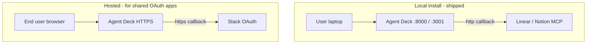

# OAuth, hosting, and deployment models

**Read this first** if OAuth, Slack, HTTPS, or “local vs hosted” has been confusing. **Product requirements & Stytch feasibility:** [OAUTH_REQUIREMENTS.md](./OAUTH_REQUIREMENTS.md). Detailed Slack steps: [SLACK_OAUTH_APP.md](./SLACK_OAUTH_APP.md). Integration tiers: [MCP_INTEGRATION_STRATEGY.md](./MCP_INTEGRATION_STRATEGY.md).

## What Agent Deck is today

| Mode | Who runs it | Dashboard | OAuth callback | Best for |
|------|-------------|-----------|----------------|----------|
| **Local (default)** | User’s machine (`agent-deck start` or `npm run dev:all`) | `http://127.0.0.1:8000` (npm) or `http://localhost:3000` (dev) | `http://localhost:8000/api/oauth/callback` unless env overrides | Linear, Notion, dev, power users |
| **Hosted (planned product path)** | Agent Deck team on HTTPS | `https://your-domain` | `https://your-domain/api/oauth/callback` | Shared Slack/Google apps, non-technical users |

Agent Deck is **primarily a local MCP proxy**. OAuth for easy providers (Linear, Notion) works on localhost. **Slack public distribution** requires an **HTTPS** redirect on **your** server — not tunnels as the product design; you deploy Agent Deck (or at least its backend) on HTTPS.



## OAuth redirect URI (how it is chosen)

Configured in `packages/backend/src/config/oauth-redirect.ts`. Used in provider apps, manifests, and the Connect flow.

| Priority | Environment variable | Result |
|----------|---------------------|--------|
| 1 | `AGENT_DECK_OAUTH_REDIRECT_URI` | Exact URL (e.g. `https://oauth.agent-deck.dev/api/oauth/callback`) |
| 2 | `AGENT_DECK_PUBLIC_URL` | `{PUBLIC_URL}/api/oauth/callback` |
| 3 | *(default)* | `http://localhost:8000/api/oauth/callback` |

After OAuth, the browser returns to the dashboard via `AGENT_DECK_DASHBOARD_URL` or bundled UI on the API origin ([paths.ts](../packages/backend/src/lib/paths.ts)).

### When to use HTTP vs HTTPS

| Scenario | Redirect URL |
|----------|----------------|
| Local dev — Linear, Notion, testing | `http://localhost:8000/api/oauth/callback` (default) |
| Slack app with **public distribution** | **Must be `https://`** on your deployed backend |
| Production shared OAuth (Slack, Google) | `https://your-domain/api/oauth/callback` |

Register the **same** URL in the provider’s OAuth app (Slack → OAuth & Permissions → Redirect URLs).

## Slack: three paths (pick one)

| Path | User effort | Needs HTTPS host | Doc |
|------|-------------|------------------|-----|
| **A. Managed** — Agent Deck shared app | Click Connect | Yes (for distribution) | [SLACK_OAUTH_APP.md](./SLACK_OAUTH_APP.md) |
| **B. Manual** — user’s own Slack app + manifest | ~10 min once | Yes for distribution; internal app in one workspace can use localhost for testing only | UI copy manifest + [slack-mcp.manifest.json](./examples/slack-mcp.manifest.json) |
| **C. Read-only** — user token, no `mcp.slack.com` | Paste `xoxp-` token | No | [SLACK_READ_WORKAROUND.md](./SLACK_READ_WORKAROUND.md) |

Env vars for path A:

```bash
AGENT_DECK_SLACK_CLIENT_ID=...
AGENT_DECK_SLACK_CLIENT_SECRET=...
AGENT_DECK_PUBLIC_URL=https://oauth.agent-deck.dev   # when hosted
```

## Hosting the HTTPS backend (maintainers)

Goal: one small always-on server with TLS for OAuth callbacks (and optionally the full dashboard).

| Option | Approx. cost | Notes |
|--------|--------------|-------|
| Fly.io + volume | ~$3–5/mo | Git deploy, HTTPS included, persist SQLite |
| Hetzner VPS + Caddy | ~€4–5/mo | Node 24 + TLS |
| Oracle Cloud free tier | $0 | More setup |

**Runtime on server:** Node **24** (or 20+). See [SETUP.md](./SETUP.md). Set `AGENT_DECK_PUBLIC_URL`, store secrets in env (never in git).

Minimal env on host:

```bash
NODE_ENV=production
PORT=8000
AGENT_DECK_PUBLIC_URL=https://oauth.agent-deck.dev
AGENT_DECK_DASHBOARD_URL=https://oauth.agent-deck.dev
AGENT_DECK_SLACK_CLIENT_ID=...
AGENT_DECK_SLACK_CLIENT_SECRET=...
```

## Provider quick reference (default preset cards)

| Service | Auth tier | Works on localhost? |
|---------|-----------|---------------------|
| Linear, Notion | Auto (DCR + PKCE) | Yes |
| GitHub, Google, Slack | BYO app or managed (Slack) | OAuth app registration; Slack **distribution** needs HTTPS |
| Figma remote | Often blocked (allowlist) | — |
| Slack read-only | User token in vault | Yes (no remote MCP) |

## Shipped OAuth behavior (reference)

- Status: `GET /api/oauth/:serviceId/status` → `authenticated`, `hasToken`, `isExpired`
- Tokens without `expires_at` count as valid
- Collection warnings do not require `Authorization` header on the service row

## Related docs

| Doc | Contents |
|-----|----------|
| [OAUTH_REQUIREMENTS.md](./OAUTH_REQUIREMENTS.md) | Product OAuth requirements, vendor tiers, Slack marketplace, Stytch |
| [SETUP.md](./SETUP.md) | Node version, install, ports, env vars |
| [SLACK_OAUTH_APP.md](./SLACK_OAUTH_APP.md) | Register shared Slack app, distribution, HTTPS |
| [SLACK_READ_WORKAROUND.md](./SLACK_READ_WORKAROUND.md) | DM/channel read without official MCP |
| [MCP_INTEGRATION_STRATEGY.md](./MCP_INTEGRATION_STRATEGY.md) | Tiers, deferred work, matrix |
| [USER_GUIDE.md](./USER_GUIDE.md) | Dashboard OAuth UX |
