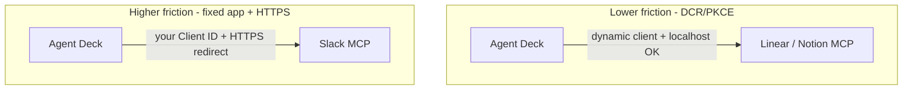
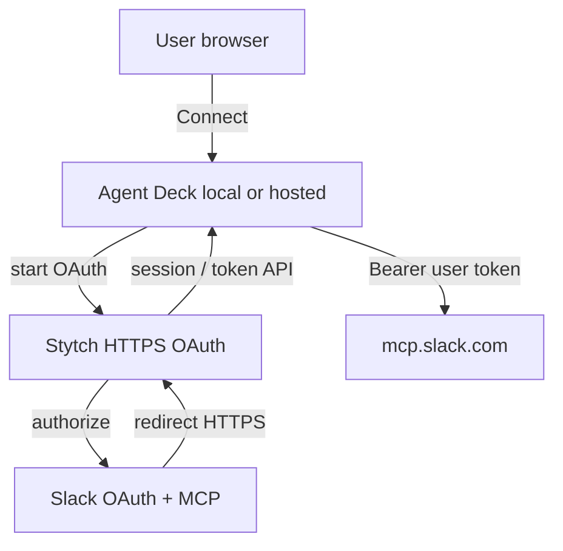

# OAuth requirements for Agent Deck

**Purpose:** One place to understand why third-party MCP is hard for a new product, what OAuth Agent Deck must provide, what each vendor expects, and what you must ship for **one-click Slack** (including marketplace registration).

**As-built decision (2025):** Managed Slack OAuth (Stytch broker, hosted callback, shared app one-click) is **deferred**. See [decisions/slack-oauth-stytch-deferred.md](./decisions/slack-oauth-stytch-deferred.md) for the full spike notes and architecture. **Ship today:** auto OAuth (Linear/Notion), BYO OAuth (Slack/Google/GitHub), honest fallbacks.

> **Product scope (2026-07):** Local-first, single-user per [DIRECTION.md](./DIRECTION.md). Hosted / managed OAuth paths below are **archive** — see [decisions/slack-oauth-stytch-deferred.md](./decisions/slack-oauth-stytch-deferred.md).

**Related:** [OAUTH_AND_HOSTING.md](./OAUTH_AND_HOSTING.md) (operational setup), [SLACK_OAUTH_APP.md](./SLACK_OAUTH_APP.md) (Slack app steps), [MCP_INTEGRATION_STRATEGY.md](./MCP_INTEGRATION_STRATEGY.md) (tiers and roadmap).

---

## Product overview

Agent Deck is a **local MCP hub**: one agent-facing endpoint (`/mcp`), a dashboard for humans, and **decks** that scope which MCP servers and credentials are active for a workspace.

| Layer | Role |
|-------|------|
| **Agent (Cursor, Claude, etc.)** | Talks MCP to Agent Deck only |
| **Agent Deck** | Proxies tools, stores tokens locally, runs OAuth Connect in the browser |
| **Third-party MCP servers** | Linear, Notion, Slack (`mcp.slack.com`), Google, etc. |

Humans use the dashboard for **OAuth consent** and **API key entry**; agents use MCP tools for everything else.

**Goal for OAuth:** A non-technical user opens Agent Deck, clicks **Connect** on Slack (or Linear, Notion, …), approves in the provider’s UI, and returns authenticated — without creating developer apps, editing env files, or running tunnels.

---

## Why third-party MCP is a barrier for an unknown app

MCP is a **wire protocol**. OAuth is **who is allowed to act on whose behalf**. Vendors treat those separately.

| Who | What users experience |
|-----|------------------------|
| **Cursor, Claude Code, Claude.ai** | One-click Slack/Linear — vendor **pre-registered** partner OAuth apps |
| **Agent Deck (new / unlisted product)** | Same MCP URLs, but **no partner slot** — you must supply **your own OAuth client identity** where the vendor requires it |

So the barrier is not “implement MCP.” It is:

1. **Registered OAuth client** — fixed Client ID (and usually secret) per vendor rules  
2. **HTTPS callback** — for apps with public / marketplace distribution (Slack, Google)  
3. **User trust** — workspace admins approve **your** app name in Slack, not “Cursor”  
4. **Scope and token shape** — must match what the remote MCP server accepts (Slack MCP is stricter than generic “Sign in with Slack”)

Agent Deck’s job is to **hide** (1)–(2) for end users via a **managed** or **hosted** path, while being honest about (3)–(4).

---

## Basic OAuth mechanism Agent Deck needs

Regardless of vendor, Agent Deck implements the same **client-side OAuth pattern**:

| Step | Agent Deck behavior |
|------|---------------------|
| 1. Discover | MCP or preset metadata → authorization URL, token URL, scopes |
| 2. Start | Open browser to provider authorize URL (PKCE where required) |
| 3. Callback | Receive `code` on redirect URI (`/api/oauth/callback`) |
| 4. Exchange | POST code + client credentials → access token (and refresh if offered) |
| 5. Store | Persist token on the service row (SQLite); attach to MCP requests |
| 6. Status | `GET /api/oauth/:id/status` → `authenticated` for UI and warnings |

**Redirect URI resolution** (see `packages/backend/src/config/oauth-redirect.ts`):

| Priority | Env | Result |
|----------|-----|--------|
| 1 | `AGENT_DECK_OAUTH_REDIRECT_URI` | Exact callback URL |
| 2 | `AGENT_DECK_PUBLIC_URL` | `{PUBLIC_URL}/api/oauth/callback` |
| 3 | Default | `http://localhost:8000/api/oauth/callback` |

**Shipped behavior:** Tokens without expiry are valid; collection warnings do not require an `Authorization` header on the service row when a stored OAuth token exists.

What **varies by vendor** is whether Agent Deck can use **Dynamic Client Registration (DCR)** or must use a **pre-registered app**, and whether the callback must be **HTTPS**.

---

## Requirements to connect each third-party service

### Tier A — Auto (DCR + PKCE, localhost OK)

| Provider | Remote MCP | Agent Deck needs | User needs |
|----------|------------|------------------|------------|
| **Linear** | Yes | Implement standard OAuth + PKCE; no fixed Client ID | Click Connect |
| **Notion** | Yes | Same | Click Connect |

**Vendor requirements:** None beyond user consent in browser. Works on local install.

---

### Tier B — BYO OAuth app (fixed Client ID + secret)

| Provider | Remote MCP | Agent Deck needs | User needs (today) |
|----------|------------|------------------|---------------------|
| **GitHub** | Yes | OAuth app in GitHub settings; redirect URI registered | Create app or use PAT |
| **Google** (Gmail, Calendar, Drive) | Yes (remote) / local stdio | Google Cloud OAuth client; restricted scopes | Not seeded — **Drive:** [GOOGLE_DRIVE_WORKAROUND.md](./GOOGLE_DRIVE_WORKAROUND.md) |
| **Figma** | Yes | OAuth app; often **vendor allowlist** | Create app; may still be blocked |

**Vendor requirements:** User (or maintainer) registers OAuth app; redirect URI must match Agent Deck callback (localhost often OK for dev).

---

### Tier C — Slack (fixed app + MCP + HTTPS for real users)

Slack is the strictest default preset because **Slack MCP does not support DCR** and **public distribution requires HTTPS redirect URLs**.

| Requirement | Owner | Detail |
|-------------|-------|--------|
| Slack app registration | **Agent Deck maintainers** (shared app) or power user (BYO) | [api.slack.com/apps](https://api.slack.com/apps) — From manifest recommended |
| **MCP enabled** | Maintainer | Agents & AI Apps → Model Context Protocol |
| **User scopes** | Maintainer | MCP user scopes in manifest (see [slack-mcp.manifest.json](./examples/slack-mcp.manifest.json)) |
| **PKCE** | Maintainer | OAuth & Permissions → opt in |
| **Client ID + secret** | Maintainer env / hosted secrets | `AGENT_DECK_SLACK_CLIENT_ID`, `AGENT_DECK_SLACK_CLIENT_SECRET` |
| **HTTPS redirect URI** | Maintainer | Registered in Slack app; required for **public distribution** |
| **Public distribution** | Maintainer | Manage Distribution → activate (any workspace can OAuth) |
| **Marketplace listing** | Maintainer (later) | App Directory — privacy policy, support URL, review; stronger enterprise trust |
| **Per-user OAuth** | Automatic | Each user authorizes **their** workspace; tokens stored per user in Agent Deck |

**User experience target (managed path):** Click Connect → Slack consent for app **“Agent Deck”** → done. No manifest, no env vars on user machine.

**Paths if managed is unavailable:**

| Path | User effort | HTTPS |
|------|-------------|-------|
| **A. Managed shared app** | One click | Required on maintainer side |
| **B. BYO app + manifest** | ~10 min once | Required for distribution |
| **C. Read-only user token** | Paste `xoxp-` | No remote MCP — see [SLACK_READ_WORKAROUND.md](./SLACK_READ_WORKAROUND.md) |

Official reference: [Slack MCP server](https://docs.slack.dev/ai/slack-mcp-server/).

---

### Tier D — Other patterns

| Pattern | Examples | Notes |
|---------|----------|-------|
| **PAT / API key in vault** | GitHub PAT, custom MCP | No OAuth UI |
| **Host-only OAuth** | Slack in Cursor native connector | Agent Deck not in path |
| **Local stdio** | Obsidian, custom scripts | No remote OAuth |

---

## Final requirements (consolidated)

What Agent Deck must have **as a product** to make third-party MCP usable for non-technical users:

### 1. OAuth client infrastructure (all tiers)

- [x] Authorize → callback → token exchange → storage → status API  
- [x] PKCE where providers require it  
- [x] Configurable redirect URI (env)  
- [ ] Encrypted token storage at rest (deferred)  
- [ ] RFC 8707 `resource` parameter when metadata provides it (deferred)

### 2. Per-vendor connection policy

- [x] Tier labels in code/guides (auto vs manual vs managed)  
- [ ] Connection tier badges on preset cards (planned)  
- [x] Slack managed mode when `AGENT_DECK_SLACK_*` set  
- [x] Slack manifest + UI copy for BYO path  

### 3. Slack one-click (marketplace path) — **maintainer / hosted**

These are **in addition** to Agent Deck code; they are what unlock “Connect like Cursor” for Slack:

| # | Requirement | Notes |
|---|-------------|-------|
| 1 | **One Slack app** owned by Agent Deck | Single Client ID for all users |
| 2 | **MCP + scopes + PKCE** on that app | Manifest + dashboard toggles |
| 3 | **HTTPS OAuth redirect** | Stable URL Slack accepts for public distribution |
| 4 | **Public distribution** enabled | Other workspaces can install / authorize |
| 5 | **Client secret** on server only | Never in OSS default install |
| 6 | **Marketplace submission** (recommended) | Privacy policy, support, branding, security review |
| 7 | **Hosted Connect entry** (for OSS users) | User’s local Agent Deck must reach **your** HTTPS start/callback OR use broker — local-only cannot embed secret |

### 4. End-user requirements (after you ship managed Slack)

| User action | Required? |
|-------------|-----------|
| Create Slack app | **No** |
| Set env vars | **No** |
| Run ngrok / tunnel | **No** |
| Click Connect in Agent Deck | **Yes** |
| Approve app in Slack (their workspace) | **Yes** |
| Admin approval if workspace policy requires | **Sometimes** (marketplace helps) |

---

## HTTPS OAuth handling: self-host vs Stytch

> **Deferred (2025):** Option A (self-hosted callback) and Option B (Stytch broker) are not pursuing for now. Spike findings and recommended tiers are in [decisions/slack-oauth-stytch-deferred.md](./decisions/slack-oauth-stytch-deferred.md). The sections below remain as historical feasibility notes.

You asked whether **Stytch** can handle the **HTTPS OAuth callback** part for **Slack app / marketplace registration**, so users connect easily without you running full Agent Deck on Fly/Hetzner **only for OAuth**.

### What Slack marketplace / public distribution actually requires

Slack cares about **your app record**, not who implements the callback:

| Slack requires | Stytch replaces? |
|----------------|------------------|
| Registered app with name, icon, description | **No** — you still create the Slack app |
| MCP enabled + user scopes | **No** |
| **HTTPS** redirect URL(s) in OAuth settings | **Partially** — see below |
| Public distribution / marketplace listing | **No** — you still submit listing |
| Valid OAuth flow → user token for MCP | **Maybe** — must validate token works with `mcp.slack.com` |

The redirect URL in the Slack app must be **exactly** what the user’s browser hits after consent. It can be:

- `https://oauth.agent-deck.dev/api/oauth/callback` (self-hosted Agent Deck), or  
- `https://…stytch.com/…` (Stytch OAuth provider callback), if you integrate that way.

Slack does **not** require the callback to be on your domain — only that it is **HTTPS** and registered.

### Stytch product that fits (and what does not)

| Stytch product | Fit for Slack upstream OAuth? |
|----------------|------------------------------|
| **[Connected Apps / MCP auth](https://stytch.com/docs/connected-apps/overview)** | **No** — makes **Agent Deck** the authorization server for MCP clients. Opposite direction. |
| **[OAuth — Slack provider](https://stytch.com/docs/multi-tenant-auth/authentication/oauth/adding-providers/slack)** (B2B or Consumer) | **Possible** — Stytch holds your Slack Client ID/Secret, hosts HTTPS callback, returns Slack access token via API |

### Feasible architecture with Stytch (Slack broker)

**Setup (maintainers, once):**

1. Register Slack app (manifest, MCP, scopes) — unchanged.  
2. In Slack → Redirect URLs → add **Stytch’s** redirect URI (from Stytch dashboard).  
3. In Stytch → configure Slack provider with **your** Client ID + Secret.  
4. In Agent Deck → optional “Slack via Stytch” connector: start Stytch OAuth with **`custom_scopes`** for MCP user scopes; after redirect, fetch Slack token from Stytch API and store locally.

**What Stytch gives you:**

- HTTPS callback without operating TLS infrastructure  
- Centralized secret storage (Slack client secret in Stytch, not on every install)  
- Standard OAuth/PKCE handling on their side  

**What Stytch does not give you:**

- Slack app creation, MCP toggle, marketplace listing, or admin trust — still your work  
- Proof that Stytch-issued tokens work with **Slack MCP** until you spike it  

### Open validation (required before committing)

| Risk | Why it matters |
|------|----------------|
| **Token type / OAuth flow** | Slack MCP expects **user token** flow with MCP-enabled app. Stytch’s default Slack integration skews **Sign in with Slack** (`openid`, profile). You need **`custom_scopes`** matching [manifest user scopes](./examples/slack-mcp.manifest.json). |
| **MCP compatibility** | After spike: call `https://mcp.slack.com/mcp` with token from Stytch. Failures here block the approach. |
| **Product model** | Consumer vs B2B Stytch project — local Agent Deck likely Consumer or one-org-per-user. |
| **Cost & dependency** | Stytch billing vs ~$5/mo VPS; third-party trust boundary. |
| **Dual systems** | Stytch session + Agent Deck SQLite — more moving parts than self-hosted callback. |

**Verdict:** **Feasible as an OAuth HTTPS broker for your Slack marketplace app**, not a replacement for Slack registration. Treat as **Option B** alongside **Option A (self-hosted Agent Deck callback)**. Do **not** use Stytch Connected Apps for this goal.

| Option | Pros | Cons |
|--------|------|------|
| **A. Self-hosted `AGENT_DECK_PUBLIC_URL`** | One stack; callback + dashboard same origin; full control | You run TLS + small server |
| **B. Stytch Slack OAuth provider** | No OAuth TLS ops; secret in Stytch | Vendor lock-in; MCP token spike; extra API hop |
| **C. OAuth broker (Nango, Composio, …)** | Built for “connect Slack API” product shape | Cost; another vendor |

**Recommendation:** Register the Slack app and enable public distribution **now** with whichever HTTPS callback you will keep long-term. Run a **short spike**: Stytch + `custom_scopes` → token → `mcp.slack.com`. If pass, document Stytch env vars alongside managed Slack. If fail, use Option A only.

---

## Summary table: who does what for Slack marketplace + easy Connect

| Concern | Agent Deck code | Maintainer | End user |
|---------|-----------------|------------|----------|
| MCP proxy / tools | ✓ | | |
| Connect UI + token storage | ✓ | | |
| Slack app + MCP + scopes | | ✓ | |
| HTTPS redirect (self-host or Stytch) | ✓ or integrate | ✓ | |
| Public distribution | | ✓ | |
| Marketplace listing | | ✓ | |
| OAuth consent | | | ✓ |
| Embed client secret in OSS install | ✗ | | |

---

## Related docs

| Doc | Use when |
|-----|----------|
| [OAUTH_AND_HOSTING.md](./OAUTH_AND_HOSTING.md) | Choosing local vs hosted, env vars, Slack paths A/B/C |
| [SLACK_OAUTH_APP.md](./SLACK_OAUTH_APP.md) | Step-by-step Slack app registration |
| [MCP_INTEGRATION_STRATEGY.md](./MCP_INTEGRATION_STRATEGY.md) | Tiers, deferred work, alternatives |
| [SLACK_READ_WORKAROUND.md](./SLACK_READ_WORKAROUND.md) | Skip Slack MCP; user token read path |
