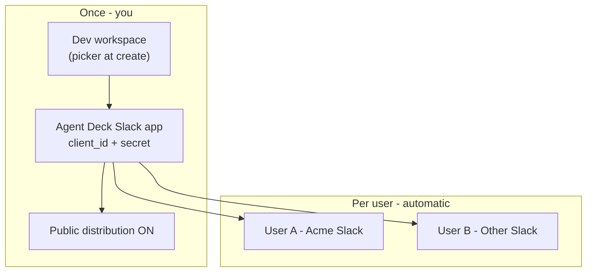

# Agent Deck–owned Slack OAuth app

> **Status (2025):** Maintainer shared-app / one-click path is **deferred** (no hosted OAuth). Use **BYO app** (below) or [SLACK_READ_WORKAROUND.md](./SLACK_READ_WORKAROUND.md). Rationale: [decisions/slack-oauth-stytch-deferred.md](./decisions/slack-oauth-stytch-deferred.md).

How to register a **shared** Slack app so Agent Deck users get one-click Connect.

**Context:** [OAUTH_REQUIREMENTS.md](./OAUTH_REQUIREMENTS.md) (why + final checklist), [OAUTH_AND_HOSTING.md](./OAUTH_AND_HOSTING.md). Node **24** on server ([SETUP.md](./SETUP.md)).

## Why this exists

Slack MCP does not support Dynamic Client Registration. Non-technical users cannot reasonably create their own Slack apps. Cursor/Claude avoid this because Slack pre-registered partner apps.

Agent Deck can do the same **if we operate one Slack app** and supply credentials at runtime.

## Important constraints

| Topic | Detail |
|-------|--------|
| **Client ID** | Public — can ship in config/docs once registered |
| **Client secret** | **Never commit** — env var or hosted secrets only |
| **App type** | Must be **Slack Marketplace** or **internal** app — unlisted apps cannot use MCP |
| **Multi-workspace** | Enable **Public distribution** so any workspace can install/authorize |
| **Redirect URIs** | **HTTPS required for public distribution** — see below |

## HTTPS redirect (required for distribution)

Slack rejects `http://` redirect URLs when you turn on public distribution. **Use your Agent Deck HTTPS URL** — the same server you provide to users.

1. Deploy the Agent Deck backend on HTTPS (e.g. `https://oauth.agent-deck.dev`).
2. Set on that server:
   ```bash
   export AGENT_DECK_PUBLIC_URL="https://oauth.agent-deck.dev"
   ```
   OAuth callback: `https://oauth.agent-deck.dev/api/oauth/callback`
3. Register **that exact URL** in Slack → **OAuth & Permissions** → Redirect URLs.
4. Activate **Manage Distribution → public distribution**.

No ngrok, no tunnel — Agent Deck *is* the HTTPS endpoint. The old `http://localhost:8000/...` default is only for local dev (Linear/Notion on your machine); Slack distribution always uses your hosted HTTPS URL.

Optional override:
```bash
export AGENT_DECK_OAUTH_REDIRECT_URI="https://oauth.agent-deck.dev/api/oauth/callback"
```

## Phase 1 — Register the app (maintainers)

### “Choose a workspace” ≠ “only for that workspace”

When Slack asks you to **pick a workspace** after **From a manifest**, that is the **development (home) workspace**:

- Where **you** manage the app (settings, credentials, MCP toggle).
- Where you **test** Connect first.
- **Not** a limit on which Slack teams can use Agent Deck later.

To let **other people’s workspaces** authorize the same app, you must turn on **public distribution** after creation (step 3 below). Until then, only the home workspace can use it.

| Step | What Slack shows | What it means |
|------|------------------|---------------|
| Pick workspace | List of teams you’re in | “Where we host this app’s admin UI” — pick any team you control (a small “Agent Deck Dev” workspace is fine). |
| Create from manifest | Paste JSON | Defines OAuth redirect, scopes, bot user — one app identity for everyone. |
| Manage Distribution → Public | Toggle / activation | “Other workspaces may install / OAuth” — **required for real users**. |
| Marketplace (later) | App Directory listing | Stronger trust + required for some enterprise admins; Slack MCP allows marketplace **or** internal apps. |

**Internal-only apps** (Enterprise Grid) work for MCP but only inside **your** company’s Slack org — not for random customers. For Agent Deck’s audience, plan **public distribution** → **Marketplace** when ready.

### Registration steps

1. Go to [api.slack.com/apps/new](https://api.slack.com/apps/new) → **From a manifest**.
2. **Pick a development workspace** — any workspace you admin (create a dedicated “Agent Deck” Slack team if you want it separate from your day job).
3. Paste [docs/examples/slack-mcp.manifest.json](./examples/slack-mcp.manifest.json) (uses HTTPS redirect). Replace `oauth.agent-deck.dev` with your real host, or set `AGENT_DECK_PUBLIC_URL` and copy manifest from the Slack card in Agent Deck.
4. After create:
   - **Agents & AI Apps** → enable **Model Context Protocol (MCP)**
   - **OAuth & Permissions** → opt in to **PKCE**
   - **Manage Distribution** → **Activate public distribution** (this is what unlocks other workspaces — not the workspace picker at create time)
5. Copy **Client ID** and **Client Secret** from Basic Information.

### What your users see later

1. User clicks **Connect** in Agent Deck.
2. Slack opens `slack.com/oauth/...` for app **Agent Deck** (your shared client ID).
3. User picks **their** workspace and approves scopes.
4. Agent Deck stores **their** user token — each workspace/user is separate; one app registration serves all of them.



### Marketplace (later, for scale)

Slack requires marketplace listing for broad trust/admin approval in many enterprises. Plan for:

- Privacy policy + support URL on agent-deck.dev
- App icon, screenshots, description
- Security review / admin install flow

Until listed, public distribution still allows OAuth for workspaces that approve the app.

## Phase 2 — Enable in Agent Deck (shipped)

Set environment variables before starting the backend:

```bash
export AGENT_DECK_SLACK_CLIENT_ID="your-client-id"
export AGENT_DECK_SLACK_CLIENT_SECRET="your-client-secret"
```

When both are set:

- Slack card uses `setupMode: managed`
- UI shows a single **Connect** button (like Linear)
- BYO manifest flow is hidden unless env vars are unset

Implementation: `packages/backend/src/config/shared-oauth-apps.ts`

## Phase 3 — Non-technical users (not shipped)

Open-source/local installs **cannot** embed the client secret. For users who will never touch env vars:

| Option | UX | Notes |
|--------|-----|-------|
| **Hosted Agent Deck OAuth** | One-click | Backend at agent-deck.dev holds secret; redirect via HTTPS |
| **OAuth broker** (Nango, etc.) | One-click | Monthly cost, third-party trust |
| **Slack partner listing** | One-click in Agent Deck | Long lead time; same as Cursor path |
| **Host-only Slack** | Use Slack in Cursor/Claude | Honest fallback; no Agent Deck proxy |

**Recommendation:** Try Phase 1–2 now (register app + env on maintainer/staging). Ship Phase 3 hosted callback when targeting non-technical users at scale.

## Verification

With env vars set:

```bash
curl -s http://127.0.0.1:8000/api/oauth/<slack-service-id>/setup | jq '.data.guide.setupMode'
# Expected: "managed"
```

Without env vars:

```bash
# Expected: "manual" + manifestJson in guide
```

## Related

- [MCP integration strategy](./MCP_INTEGRATION_STRATEGY.md)
- [Slack read-only workaround](./SLACK_READ_WORKAROUND.md) — skip `mcp.slack.com` for DM/channel read
- [Slack MCP official docs](https://docs.slack.dev/ai/slack-mcp-server/)
