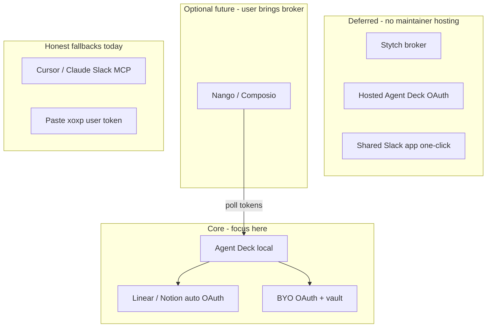

# Decision: defer managed Slack OAuth (Stytch / hosted callback)

**Status:** Accepted — dropped (June 2025)  
**Supersedes:** Stytch broker (Option B) and self-hosted HTTPS callback (Option A) as near-term goals  
**Related:** [OAUTH_REQUIREMENTS.md](../OAUTH_REQUIREMENTS.md), [OAUTH_AND_HOSTING.md](../OAUTH_AND_HOSTING.md), [SLACK_OAUTH_APP.md](../SLACK_OAUTH_APP.md), [SLACK_READ_WORKAROUND.md](../SLACK_READ_WORKAROUND.md), [MCP_INTEGRATION_STRATEGY.md](../MCP_INTEGRATION_STRATEGY.md)

---

## Context

Agent Deck needs third-party MCP connections (Slack, Linear, Notion, …) as a **prerequisite**, not as core product identity. Core work is decks, MCP proxy, credentials, and local orchestration.

Slack MCP (`https://mcp.slack.com/mcp`) does not support Dynamic Client Registration. Public distribution requires a **registered Slack app** and an **HTTPS** OAuth redirect (or a broker that provides one). Non-technical “one-click Connect like Cursor” implies maintainer-operated OAuth infrastructure.

We explored:

| Option | Description |
|--------|-------------|
| **A — Self-hosted Agent Deck** | Deploy `https://oauth.agent-deck.dev`; callback `{PUBLIC_URL}/api/oauth/callback`; `AGENT_DECK_SLACK_*` env |
| **B — Stytch Slack OAuth broker** | Slack redirect → Stytch HTTPS callback; Stytch holds client secret; Agent Deck completes flow locally |

**Decision:** Drop A and B for now. No maintainer-hosted OAuth. Focus core dev.

---

## What we tried

### 1. Runtime OAuth redirect (shipped)

**File:** `packages/backend/src/config/oauth-redirect.ts`

Local default is now `http://127.0.0.1:{port}/api/oauth/callback` where port comes from `AGENT_DECK_PORT` / `PORT` (default 8000). Helps **BYO OAuth** (user’s own Slack/Google app); does **not** solve centralized broker callbacks.

### 2. Stytch setup (maintainer)

- Slack app redirect registered to Stytch HTTPS callback:  
  `https://test.stytch.com/v1/oauth/callback/oauth-callback-test-f71256af-83e4-48a3-817f-12488a84aceb`
- Stytch Consumer project; Slack provider configured with app Client ID + Secret
- Stytch Redirect URLs (test): login + signup → `http://127.0.0.1/api/oauth/stytch/callback` (portless)

### 3. Spike script (local only, not committed)

`.temporal/scripts/stytch-slack-oauth-spike.mjs` — probe + full OAuth → authenticate → `mcp.slack.com` test. Requires `STYTCH_PUBLIC_TOKEN`, `STYTCH_PROJECT_ID`, `STYTCH_SECRET`. Logs under `.temporal/logs/`.

---

## Findings

### Stytch Consumer OAuth redirect URLs

| `login_redirect_url` / `signup_redirect_url` | Stytch response |
|-----------------------------------------------|-----------------|
| `http://127.0.0.1/api/oauth/stytch/callback` (no port), **both** login + signup registered | **302 OK** |
| Same URL with `:8000`, `:8010`, `:54321` | **400** `no_match_for_provided_oauth_url` |
| Login registered only, both params in request | **400** (signup must match too) |

**Port-agnostic loopback does not work** for Consumer OAuth the way Connected Apps docs describe. Only the **exact** portless string matches. Browsers treat that as **port 80**, not “any port Agent Deck uses.”

**Implication:** Centralized Stytch + localhost return cannot serve users on `AGENT_DECK_PORT=8010` (or any port ≠ 80). Users cannot add redirect URLs to maintainer’s Stytch project.

### Slack OAuth flow via Stytch Consumer

Stytch start returns Slack **`openid/connect/authorize`**, not **`oauth/v2_user/authorize`**. Slack MCP discovery expects the latter. MCP compatibility was **not validated** end-to-end (authenticate → token → `mcp.slack.com` spike incomplete).

Stytch **B2B** Slack start examples use `v2/authorize` + `user_scope`; Consumer path skews Sign-in-with-Slack. Wrong product shape for Slack MCP user tokens unless proven otherwise.

### Port 8000 vs 8010 (local Agent Deck)

| Scenario | Outcome |
|----------|---------|
| User runs default port 8000 | BYO OAuth works if their Slack app lists matching redirect |
| Port 8000 busy → `AGENT_DECK_PORT=8010` | BYO works if **user** updates their Slack app redirect |
| Maintainer Stytch / shared app with fixed redirect | **Broken** for other ports; no self-service fix |

8000 is a reasonable default; the risk is **maintainer-centralized OAuth**, not the default port itself.

### Composio / Nango (reference architecture)

Brokers avoid localhost callback for the **provider → broker** leg (`api.nango.dev`, Composio cloud). Local apps **poll API** or use hosted Connect UI. No maintainer port whitelist problem. Tradeoff: vendor, cost, user/org brings API key — acceptable as **optional Tier C**, not maintainer ops.

---

## Decision

**Do not ship:**

- Stytch integration in Agent Deck
- Maintainer shared Slack app / `AGENT_DECK_SLACK_*` managed mode as product promise
- Custom hosted OAuth bridge or token-exchange service
- Marketplace Slack app as a gate for core development

**Do ship / keep:**

| Tier | Providers | Model |
|------|-----------|--------|
| **A — Auto** | Linear, Notion | DCR + PKCE; localhost OK |
| **B — BYO** | Slack, Google, GitHub | User registers app; manifest + paste credentials; runtime local redirect |
| **D — Defer** | Slack MCP “like Cursor” | Document: native IDE connector or [read-only workaround](../SLACK_READ_WORKAROUND.md) |

**Revisit later (optional Tier C):** User/org-configured Composio or Nango (`COMPOSIO_API_KEY` / `NANGO_SECRET_KEY` in env). Agent Deck adapter only; **no** Agent Deck-hosted OAuth.

---

## Architecture (as-built intent)

**Principle:** Agent Deck is not an OAuth authorization server or callback host. Third-party connect is plumbing; excellence is in decks, MCP proxy, and credentials.

---

## If we revisit one-click Slack

Minimum bar before coding:

1. **No localhost callback** to maintainer-owned IdP — use hosted connect + poll **or** user-owned broker account.
2. Prove token works with `https://mcp.slack.com/mcp` (`v2_user` / user scopes).
3. Explicit cost/ops owner (broker SaaS vs small VPS still = ops).

**Do not retry:** Consumer Stytch + exact localhost redirect whitelist as the primary design.

---

## Code / artifacts from this exploration

| Item | Location | Action |
|------|----------|--------|
| Runtime port redirect | `packages/backend/src/config/oauth-redirect.ts` | **Keep** |
| Stytch spike script | `.temporal/scripts/stytch-slack-oauth-spike.mjs` | Scratch; safe to delete |
| Stytch integration in backend | — | **Not implemented** |
| Managed Slack env (`AGENT_DECK_SLACK_*`) | `shared-oauth-apps.ts` | **Keep code**; document as maintainer-only / not product promise |

---

## Changelog

| Date | Note |
|------|------|
| 2025-06 | Explored Stytch Option B; validated redirect URLs; deferred managed OAuth; BYO + auto tiers remain |
